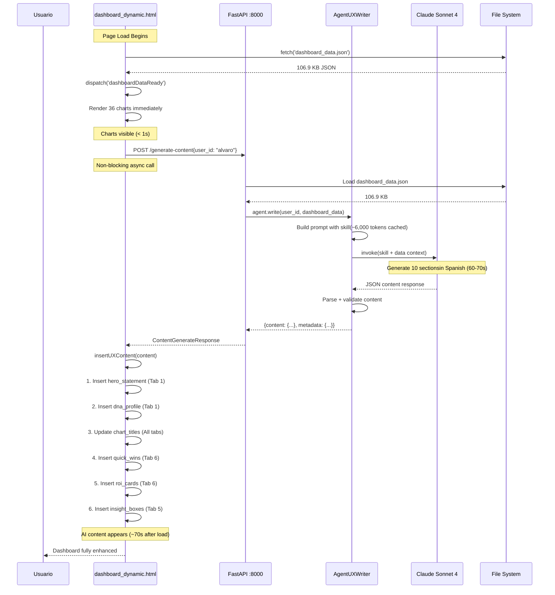
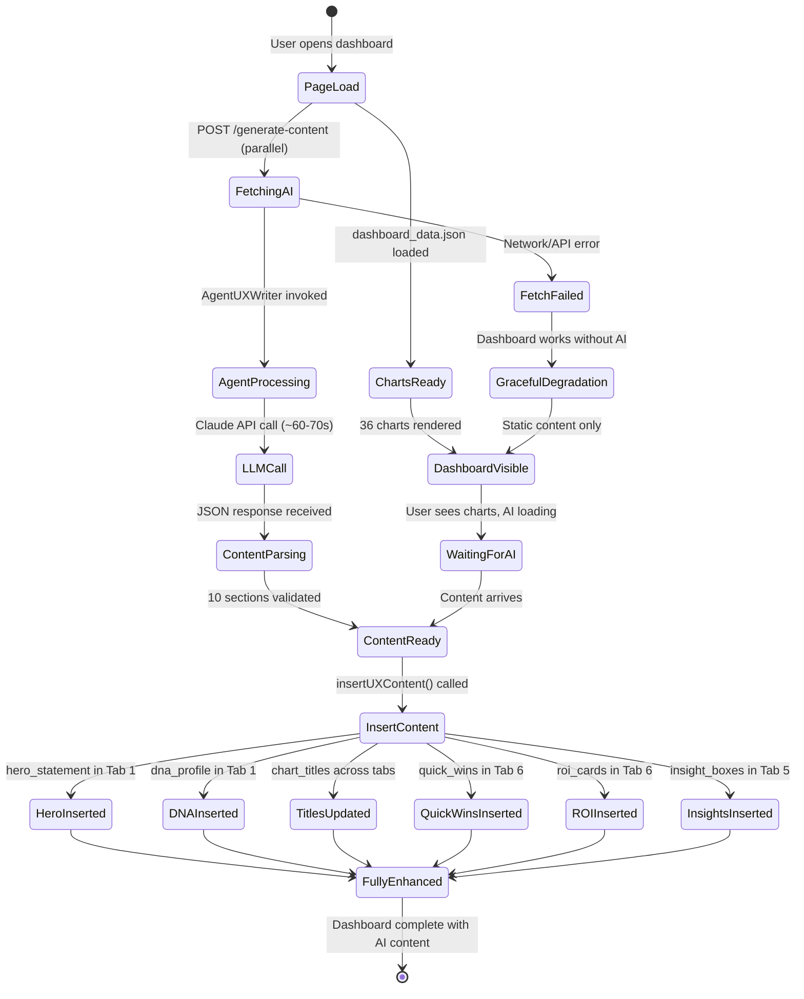
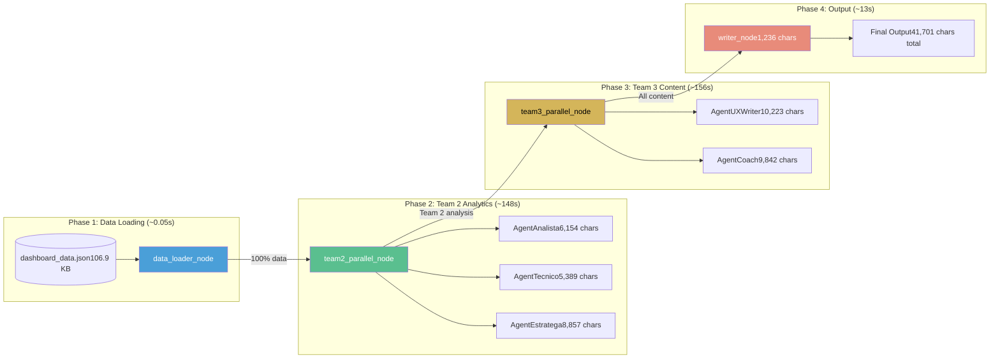
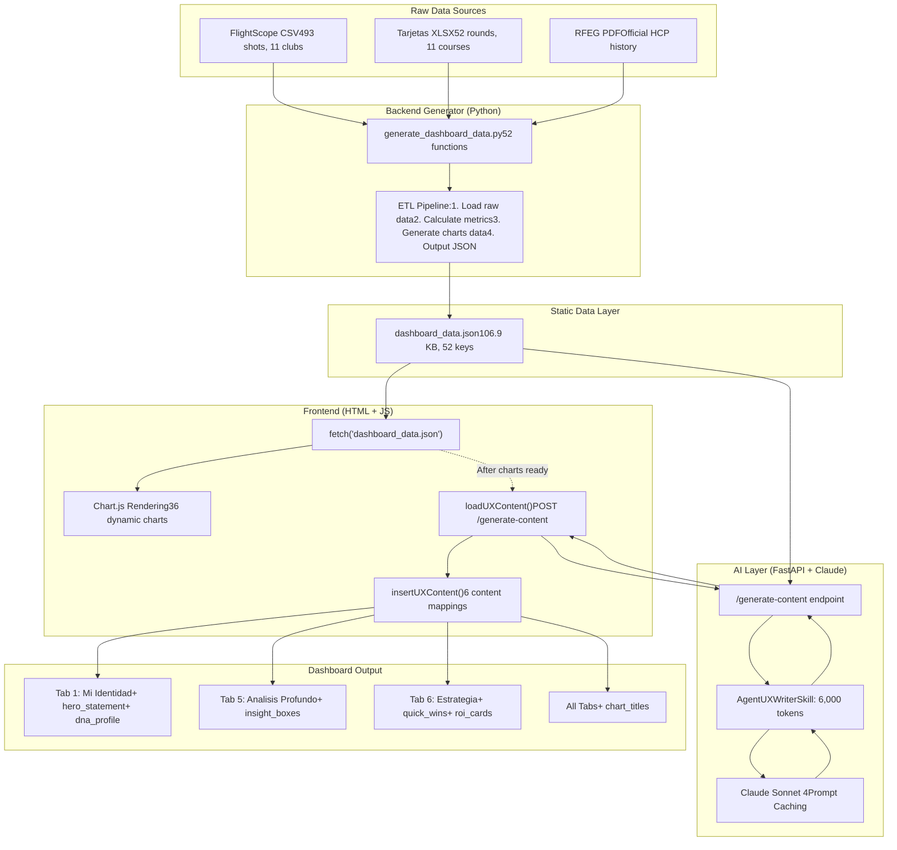
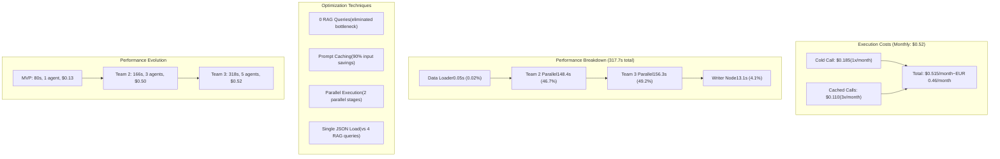
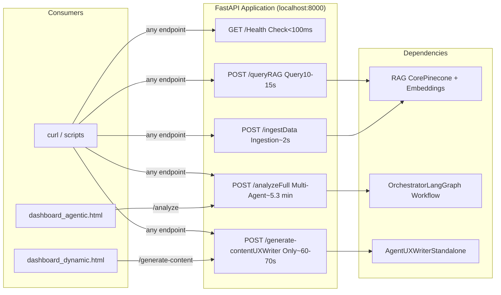
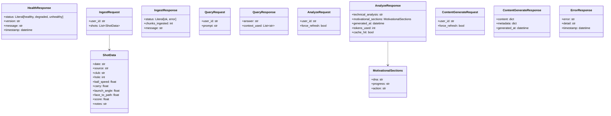

# AlvGolf - Architecture Diagrams v3.0.1

**Version:** 3.0.1 - Multi-Agent System + UXWriter Dashboard Integration  
**Date:** 2026-02-17  
**Purpose:** Comprehensive architectural reference for future development sessions

---

## 1. Complete System Architecture (v3.0.1)

```mermaid
graph TB
    subgraph "User Layer"
        U[Usuario / Browser]
    end

    subgraph "Frontend Layer"
        FD[dashboard_dynamic.htmlv5.1.1 - 36 Charts + AI Content]
        FA[dashboard_agentic.htmlMulti-Agent Insights v3.0]
    end

    subgraph "FastAPI Backend - localhost:8000"
        EP1["GET / (health)"]
        EP2["POST /ingest"]
        EP3["POST /query"]
        EP4["POST /analyze (5 agents)"]
        EP5["POST /generate-content (UXWriter)"]
    end

    subgraph "Multi-Agent Orchestrator (LangGraph)"
        DL[data_loader_node106.9 KB JSON, 0 RAG]

        subgraph "TEAM 2 - Analytics (Parallel)"
            A1[AgentAnalistaPerformance Analysis650 lines]
            A2[AgentTecnicoBiomechanics550 lines]
            A3[AgentEstrategaPractice Design600 lines]
        end

        subgraph "TEAM 3 - Content (Parallel)"
            A4[AgentUXWriterDashboard Content752 lines]
            A5[AgentCoachCoaching Reports807 lines]
        end

        WR[Dashboard WriterMotivational Sections]
    end

    subgraph "Data Processing"
        GEN[generate_dashboard_data.py52 functions, v5.1.0]
    end

    subgraph "Data Storage"
        JSON[dashboard_data.json106.9 KB, 52 keys]
        PC[Pinecone Vector DB120 vectors, namespace: alvaro]
        RAW[Raw DataFlightScope (493 shots)Tarjetas (52 rounds)]
    end

    subgraph "External Services"
        CLAUDE[Anthropic Claude Sonnet 4LLM + Prompt Caching]
        PCAPI[Pinecone Embeddingsmultilingual-e5-large, 1024 dim]
    end

    U -->|Browse| FD
    U -->|Click IA Insights| FA
    FD -->|"POST /generate-content(async, 60-70s)"| EP5
    FA -->|"POST /analyze(5.3 min)"| EP4

    EP4 --> DL
    EP5 --> A4

    DL -->|"100% data"| A1 & A2 & A3
    A1 & A2 & A3 -->|"Team 2 output20,400 chars"| A4 & A5
    A4 & A5 -->|"Team 3 output20,065 chars"| WR
    WR -->|Response| FA

    EP5 -->|"Load JSON"| JSON
    A4 -->|"Content JSON"| FD

    RAW -->|ETL| GEN
    GEN -->|Generate| JSON
    JSON -->|"fetch() on load"| FD
    JSON -->|Load| DL

    A1 & A2 & A3 & A4 & A5 -->|LLM Calls| CLAUDE
    EP2 -->|Embed + Store| PC
    EP3 -->|"Embed + Search"| PCAPI
    PCAPI --> PC
```

---

## 2. UXWriter Dashboard Integration Flow



---

## 3. AI Content Lifecycle in Dashboard



---

## 4. Multi-Agent Orchestration Workflow



---

## 5. Data Flow: Frontend-Backend-AI



---

## 6. Cost and Performance Architecture



---

## 7. API Endpoint Architecture



---

## 8. Pydantic Models Architecture (Updated v3.0.1)



---

**Created by:** Claude Sonnet 4  
**Date:** 2026-02-17  
**Purpose:** Comprehensive architectural diagrams for AlvGolf Multi-Agent System v3.0.1
