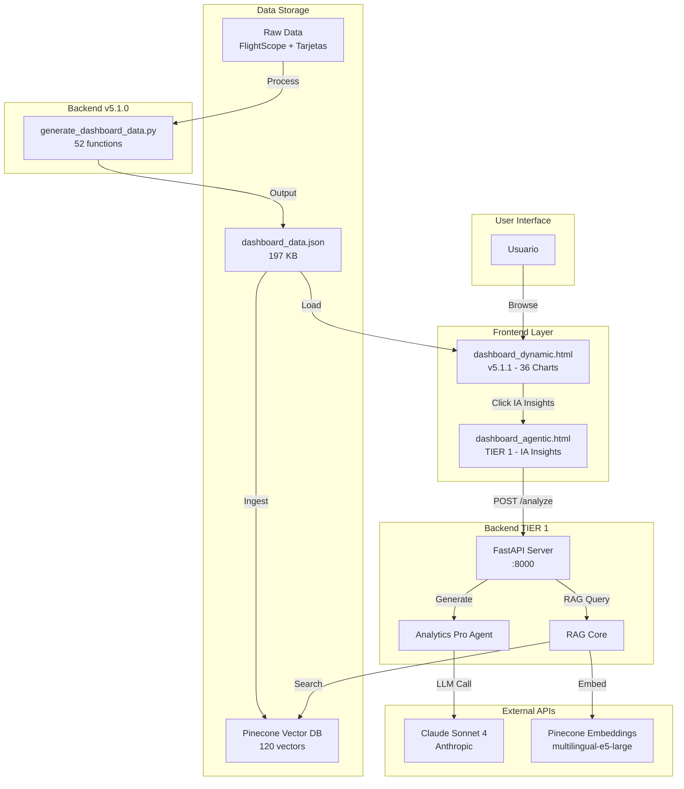
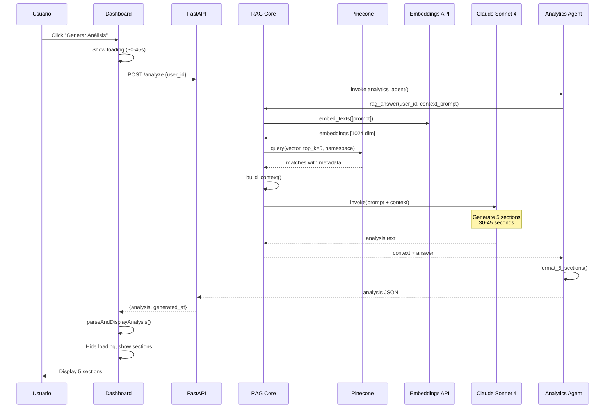
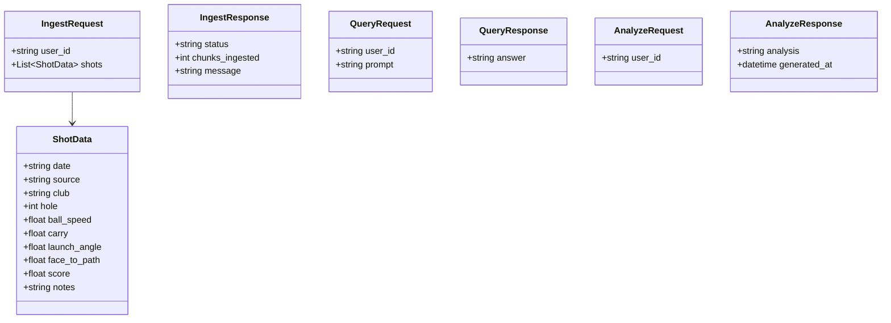
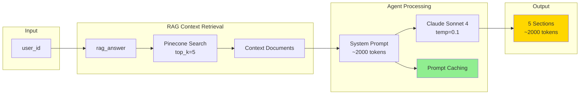
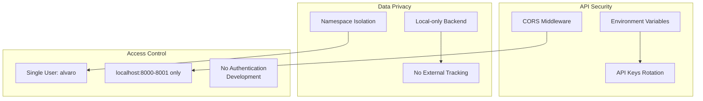
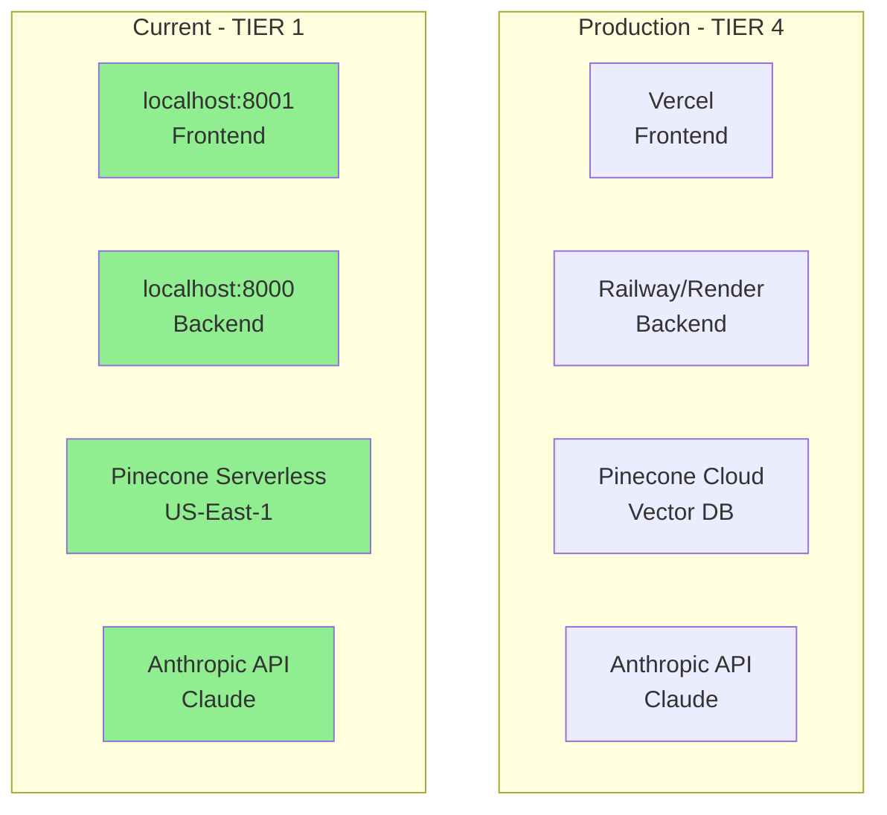
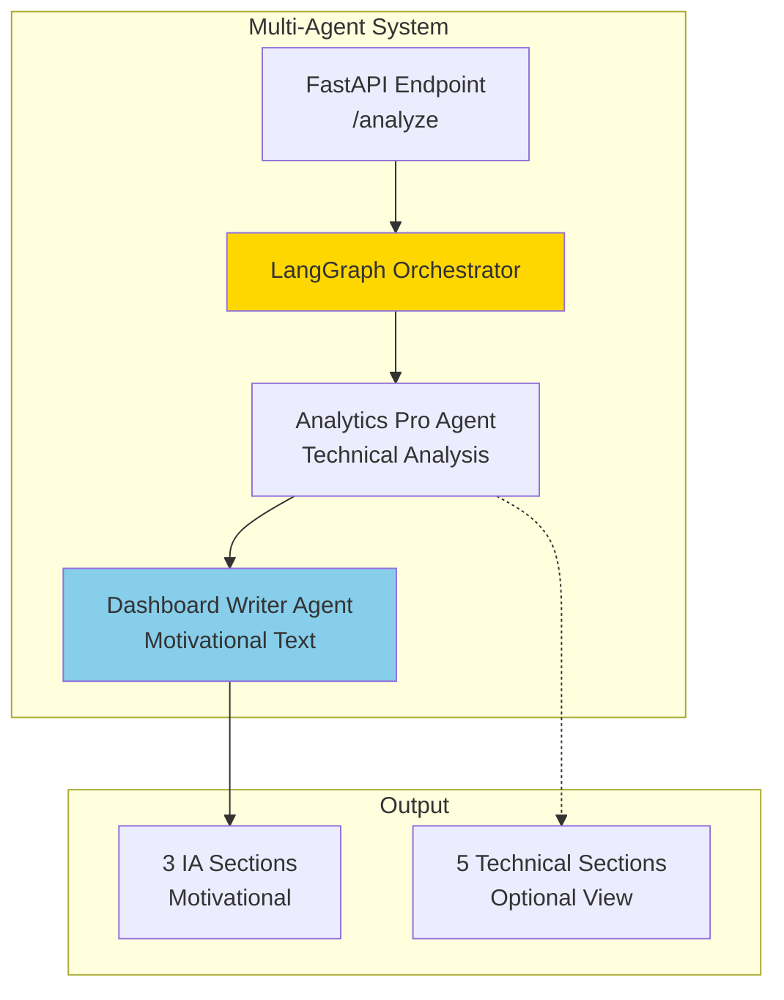
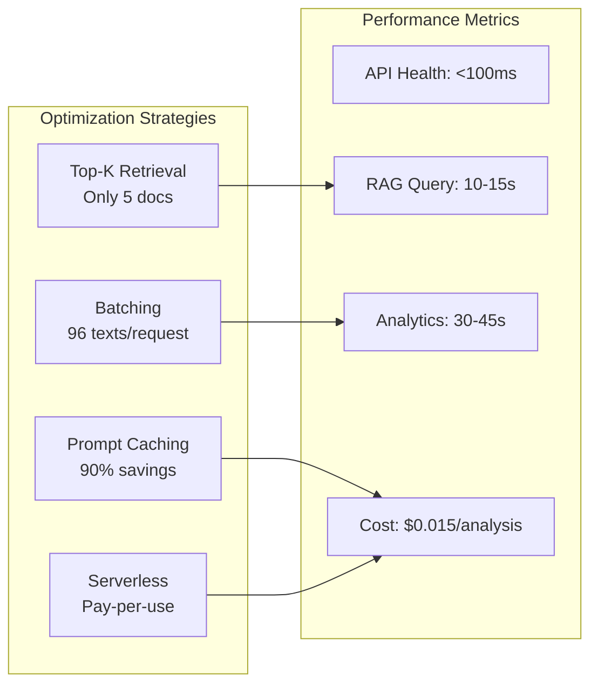
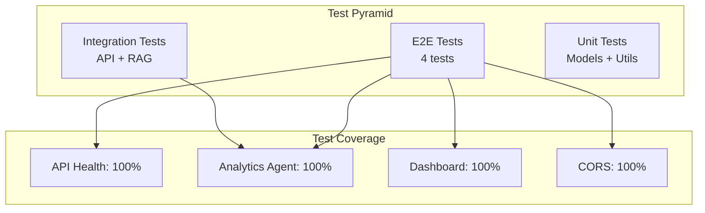
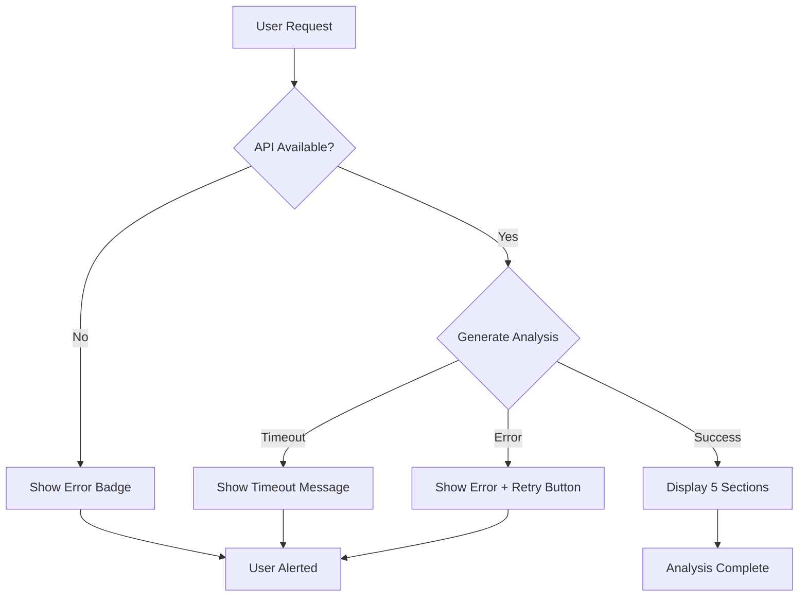

# AlvGolf - Arquitectura del Sistema

**Versión:** 5.1.1 + TIER 1
**Fecha:** 2026-02-15

---

## 🏗️ Arquitectura General



---

## 🔄 Data Flow - Analytics Agent



---

## 🗂️ Estructura de Datos

### Vector Database (Pinecone)

```mermaid
erDiagram
    PINECONE_INDEX {
        string id PK
        float vector_1024_dim
        string user_id
        string date
        string source
        string club
        string text
    }

    NAMESPACE {
        string name PK
        int vector_count
    }

    DATA_SOURCES {
        string type
        int count
    }

    PINECONE_INDEX ||--o{ NAMESPACE : contains
    NAMESPACE ||--o{ DATA_SOURCES : includes

    DATA_SOURCES {
        club_statistics 22
        momentum 52
        course_performance 11
        quarterly_scoring 7
        strokes_gained 6
        hcp_evolution 5
        best_rounds 3
        worst_rounds 3
    }
```

### API Models (Pydantic)



---

## 🎯 Analytics Pro Agent Architecture



### Agent Sections

1. **TECHNICAL PATTERNS** - Swing analysis
2. **STATISTICAL TRENDS** - Performance evolution
3. **MAIN GAPS** - Critical improvement areas
4. **RECOMMENDATIONS** - Drills + Strategy
5. **PREDICTION** - 30-day projection

---

## 🔐 Security Architecture



---

## 📈 Deployment Architecture (Future)



---

## 🔄 TIER 2 Architecture (Planned)



---

## 📊 Performance Architecture



---

## 🧪 Testing Architecture



---

## 📁 Code Architecture

```
app/
├── __init__.py
├── main.py              # FastAPI app + endpoints
├── config.py            # Settings (.env)
├── models.py            # Pydantic (10 models)
├── rag.py               # RAG Core
└── agents/
    └── analytics_pro.py # Analytics Agent

scripts/
├── ingest_full_data.py       # 120 vectors
├── test_*.py                 # 7 test scripts

dashboard_agentic.html        # 520 lines (HTML+CSS+JS)
```

---

## 🌊 Error Handling Flow



---

**Documentado por:** Claude Sonnet 4.5
**Fecha:** 2026-02-15
