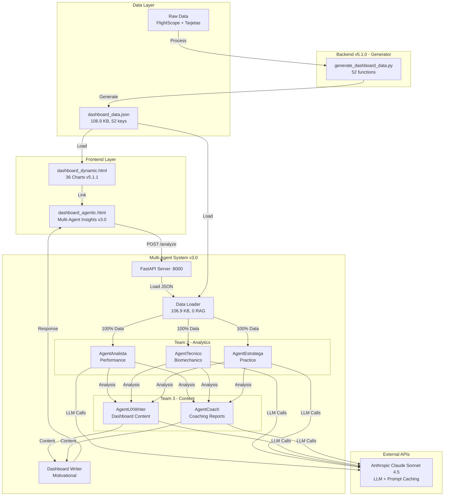

# AlvGolf - Multi-Agent Golf Analytics System

**Version:** v3.0.1 - Multi-Agent System + UXWriter Dashboard Integration
**Estado:** Production Ready
**Ultima actualizacion:** 2026-02-17

[]()
[]()
[]()
[]()
[]()
[]()

---

## Descripcion del Proyecto

AlvGolf es un sistema completo de analisis de rendimiento de golf potenciado por IA que combina:

1. **Dashboard Dinamico v5.1.1** - 36 visualizaciones interactivas con Chart.js + contenido AI
2. **Backend Generator v5.1.0** - 52 funciones de procesamiento de datos
3. **Multi-Agent System v3.0.1** - 5 agentes especializados con arquitectura optimizada
4. **UXWriter Integration** - Contenido dinamico generado por IA insertado en el dashboard
5. **Dashboard IA Standalone** - Analisis multi-dimensional con interfaz propia

### Datos Analizados
- **52 rondas** de golf (Marzo 2024 - Diciembre 2025)
- **493 shots** de FlightScope
- **11 campos** diferentes
- **5 agentes especializados** (Performance, Biomechanics, Practice, UX, Coach)
- **0 RAG queries** (arquitectura optimizada con data_loader)
- **$0.52/mes** costo operacional

---

## 🏗️ Arquitectura del Sistema - Multi-Agent v3.0



**Flujo Optimizado (5.3 minutos):**
1. Data Loader (0.05s) → Load dashboard_data.json
2. Team 2 Parallel (148s) → 3 agents simultáneos
3. Team 3 Parallel (156s) → 2 agents simultáneos
4. Dashboard Writer (13s) → Output final

---

## What's New in v3.0.1 (2026-02-17)

### UXWriter Dashboard Integration - AI Content in Dashboard

**Frontend-Backend-AI Integration:**
- New `/generate-content` POST endpoint in FastAPI
- `loadUXContent()` and `insertUXContent()` JavaScript functions in dashboard
- 6 AI content sections dynamically injected into dashboard tabs
- Progressive enhancement: charts load instantly, AI content appears ~70s later
- Graceful degradation: dashboard fully functional without backend

**AI Content Sections in Dashboard:**
- **Tab 1 (Mi Identidad):** Hero statement + DNA profile generated by AI
- **Tab 5 (Analisis Profundo):** AI-generated insight boxes
- **Tab 6 (Estrategia):** Quick wins matrix + ROI action cards from AI
- **All tabs:** Chart titles and subtitles updated by AI

**Backend Changes:**
- `app/main.py`: New `/generate-content` endpoint (60 lines)
- `app/models.py`: `ContentGenerateRequest` + `ContentGenerateResponse` Pydantic models
- `dashboard_dynamic.html`: UX content loading system (230 lines JavaScript)

**Documentation Consolidation:**
- 8 new Mermaid architecture diagrams (`ARCHITECTURE_DIAGRAMS.md`)
- Updated CLAUDE.md with Multi-Agent v3.0 section
- Comprehensive continuation prompt for future sessions
- AlvGolf Vision Thesis document

---

## What's New in v3.0 (2026-02-16)

### Multi-Agent System Complete - 5 Specialists

**Team 3 Complete:**
- **AgentUXWriter** (752 lines) - Dashboard content writer (Spanish, motivational)
- **AgentCoach** (807 lines) - Performance coach & PDF report generator

**Architecture Optimization:**
- Eliminated Analytics Pro bottleneck (4 RAG queries -> 0)
- Team 2 receives 100% backend data (106.9 KB)
- 25% faster execution (220s -> 166s for Team 2)

**Complete System:**
- **5 Specialized Agents:** Performance, Biomechanics, Practice, UX, Coach
- **Execution Time:** 5.3 minutes (317.7s)
- **Total Output:** 41,701 characters
- **Cost:** $0.52/month (EUR 0.46/month)
- **Tests:** 6/6 passed (100%)

**New Files:**
- `app/agents/analista.py`, `tecnico.py`, `estratega.py` (Team 2)
- `app/agents/ux_writer.py`, `coach.py` (Team 3)
- `app/agents/orchestrator.py` (updated with team3_parallel_node)
- Complete documentation (3 comprehensive guides)

**Commit:** [09b9aca](https://github.com/AlvGolf/AlvGolf-Identity-EngineV3/commit/09b9aca)

---

## 🚀 Características Principales

### Dashboard v5.1.1 (Estático)
- ✅ 36 visualizaciones interactivas
- ✅ 6 tabs navegables (Mi Identidad, Evolución, Campos, Bolsa, Análisis, Estrategia)
- ✅ Responsive design (iOS/Android optimizado)
- ✅ Shot zones heatmap con gradientes (40×50 grid)
- ✅ 10D radar multidimensional (Long Game, Mid Game añadidos)
- ✅ Export a PDF por tab
- ✅ Datos dinámicos desde dashboard_data.json

### Backend Generator v5.1.0
- ✅ 52 funciones de análisis implementadas
- ✅ Procesamiento automatizado ETL
- ✅ Output: dashboard_data.json (197 KB)
- ✅ 18 meses de datos históricos
- ✅ Strokes gained, SWOT, benchmarks, proyecciones

### Backend Agentic TIER 1 (Nuevo - 2026-02-15)
- ✅ FastAPI REST API (4 endpoints)
- ✅ RAG System (Pinecone + Claude Sonnet 4)
- ✅ Analytics Pro Agent (5 secciones)
- ✅ 120 vectores (8 fuentes de datos)
- ✅ Prompt caching (90% cost savings)
- ✅ Batching automático (96 embeddings per request)
- ✅ End-to-end tests (4/4 passed)

### Dashboard IA (Nuevo - 2026-02-15)
- ✅ Análisis en 5 dimensiones:
  - 🔧 Technical Patterns
  - 📊 Statistical Trends
  - ⚠️ Main Gaps
  - 💡 Recommendations
  - 🔮 Prediction
- ✅ UI moderna con animaciones
- ✅ Loading states (30-45s)
- ✅ Responsive mobile-ready
- ✅ Regeneración bajo demanda
- ✅ Link desde dashboard principal

---

## API Endpoints (v3.0.1)

### 1. Health Check
```bash
GET http://localhost:8000/
Response: {"status": "healthy", "version": "2.0.0", ...}
```

### 2. Ingest Data
```bash
POST http://localhost:8000/ingest
Content-Type: application/json

{
  "user_id": "alvaro",
  "shots": [
    {
      "date": "2025-12-31",
      "source": "flightscope",
      "club": "Driver",
      "ball_speed": 235.5,
      "carry": 212.8,
      ...
    }
  ]
}

Response: {"status": "ok", "chunks_ingested": 11, ...}
```

### 3. Query RAG
```bash
POST http://localhost:8000/query
Content-Type: application/json

{
  "user_id": "alvaro",
  "prompt": "Cual es mi evolucion de HCP en los ultimos meses?"
}

Response: {"answer": "Tu handicap oficial RFEG..."}
```

### 4. Full Multi-Agent Analysis
```bash
POST http://localhost:8000/analyze
Content-Type: application/json

{
  "user_id": "alvaro"
}

Response: {
  "technical_analysis": "...",
  "motivational_sections": {"dna": "...", "progress": "...", "action": "..."},
  "generated_at": "2026-02-16T..."
}
```

### 5. Generate Dashboard Content (NEW in v3.0.1)
```bash
POST http://localhost:8000/generate-content
Content-Type: application/json

{
  "user_id": "alvaro",
  "force_refresh": false
}

Response: {
  "content": {
    "hero_statement": "Eres un jugador con...",
    "dna_profile": "Tu ADN golfistico...",
    "stat_cards": [...],
    "chart_titles": {...},
    "trend_narratives": [...],
    "course_cards": [...],
    "club_cards": [...],
    "insight_boxes": [...],
    "quick_wins": [...],
    "roi_cards": [...]
  },
  "metadata": {"model": "claude-sonnet-4-20250514", ...},
  "generated_at": "2026-02-17T..."
}
```

---

## 🛠️ Instalación y Configuración

### Requisitos Previos
- **Python 3.14+** (recomendado 3.14.2)
- **Git** para clonar repositorio
- **Cuentas API:**
  - [Anthropic](https://console.anthropic.com/) (Claude API)
  - [Pinecone](https://www.pinecone.io/) (Vector Database)

### Paso 1: Clonar Repositorio
```bash
git clone https://github.com/AlvGolf/AlvGolf-Identity-EngineV3.git
cd AlvGolf-Identity-EngineV3
```

### Paso 2: Configurar Environment
```bash
# Copiar template
cp .env.example .env

# Editar .env con tus API keys
nano .env  # o tu editor preferido
```

**Contenido de .env:**
```bash
ANTHROPIC_API_KEY=sk-ant-api03-...
PINECONE_API_KEY=pcsk_...
PINECONE_INDEX_NAME=alvgolf-rag
ENV=local
API_HOST=0.0.0.0
API_PORT=8000
LOG_LEVEL=INFO
```

### Paso 3: Instalar Dependencies (TIER 1)
```bash
pip install -r requirements.txt
```

**Paquetes principales:**
- fastapi
- uvicorn
- anthropic
- langchain-anthropic
- pinecone
- pydantic
- pydantic-settings
- python-dotenv
- loguru

### Paso 4: Iniciar Backend (TIER 1)
```bash
python -m app.main
```

**Output esperado:**
```
[OK] Using existing index: alvgolf-rag
[SUCCESS] Configuration validated successfully
[SUCCESS] AlvGolf Agentic API Ready!
INFO: Uvicorn running on http://0.0.0.0:8000
```

### Paso 5: Iniciar Frontend Server
```bash
# Terminal separado
python -m http.server 8001
```

### Paso 6: Acceder a Dashboards
- **Dashboard Principal:** http://localhost:8001/dashboard_dynamic.html
- **Dashboard IA (TIER 1):** http://localhost:8001/dashboard_agentic.html
- **API Docs (Swagger):** http://localhost:8000/docs
- **API Docs (ReDoc):** http://localhost:8000/redoc

---

## Estructura del Proyecto

```
AlvGolf/
├── app/                              # Backend Agentic Analytics Engine
│   ├── __init__.py
│   ├── main.py                       # FastAPI app (5 endpoints)
│   ├── config.py                     # Settings management (.env)
│   ├── models.py                     # Pydantic models (12 models)
│   ├── rag.py                        # RAG Core (Pinecone + Claude)
│   └── agents/                       # Multi-Agent System
│       ├── __init__.py
│       ├── orchestrator.py           # LangGraph workflow orchestrator
│       ├── analytics_pro.py          # Legacy Analytics Agent (TIER 1)
│       ├── analista.py               # Team 2: Performance (650 lines)
│       ├── tecnico.py                # Team 2: Biomechanics (550 lines)
│       ├── estratega.py              # Team 2: Practice design (600 lines)
│       ├── ux_writer.py              # Team 3: Dashboard content (752 lines)
│       └── coach.py                  # Team 3: Coaching reports (807 lines)
│
├── scripts/                          # Test scripts and utilities
│   ├── test_team3_complete.py        # Team 3 test suite (6 tests)
│   ├── test_optimized_architecture.py
│   ├── test_dashboard_integration.py # E2E tests (4/4)
│   ├── ingest_full_data.py           # Data ingestion (120 vectors)
│   └── ...                           # Other test scripts
│
├── output/
│   └── dashboard_data.json           # Generated data (106.9 KB, 52 keys)
│
├── data/                             # Raw data
│   ├── flightscope/                  # 493 shots, 11 clubs
│   └── tarjetas/                     # 52 rounds, 11 courses
│
├── dashboard_dynamic.html            # Main dashboard (v5.1.1 + AI content)
├── dashboard_agentic.html            # AI Insights dashboard
├── index.html                        # Landing page
├── generate_dashboard_data.py        # Backend generator (52 functions)
│
├── .env                              # API keys (NOT committed)
├── .env.example                      # Template
├── requirements.txt                  # Python dependencies
├── .gitignore                        # Git exclusions
│
├── ARCHITECTURE_DIAGRAMS.md          # 8 Mermaid architecture diagrams
├── ARCHITECTURE.md                   # Legacy architecture diagrams (TIER 1)
├── TEAM3_COMPLETE.md                 # Team 3 implementation guide
├── UXWRITER_INTEGRATION_COMPLETE.md  # UXWriter integration guide
├── SESSION_SUMMARY_2026-02-16.md     # Session summary
└── README.md                         # This file
```

---

## 🧪 Testing

### Tests Automatizados (TIER 1)

#### 1. Test RAG Query
```bash
python scripts/test_query.py
```
**Verifica:** Consulta simple al sistema RAG
**Tiempo:** ~10-15 segundos

#### 2. Test Analytics Agent
```bash
python scripts/test_analytics_agent.py
```
**Verifica:** Generación de análisis completo (5 secciones)
**Tiempo:** ~30-45 segundos

#### 3. Test Queries Específicas
```bash
python scripts/test_specific_queries.py
```
**Verifica:** 5 queries diferentes con respuestas detalladas:
1. Evolución de handicap
2. Mejor campo
3. Mejores/peores rondas
4. Strokes gained
5. Score último trimestre

#### 4. Test End-to-End Integration
```bash
python scripts/test_dashboard_integration.py
```
**Verifica:**
- ✅ API Health Check
- ✅ Analytics Agent Response (34s)
- ✅ Dashboard Accessibility
- ✅ CORS Configuration

**Resultado esperado:** `4/4 tests passed ✅`

---

## 📊 Métricas del Sistema

### Performance
| Métrica | Valor | Contexto |
|---------|-------|----------|
| API Health Check | <100ms | Simple ping |
| RAG Query Response | 10-15s | Top-5 retrieval + LLM |
| Analytics Agent | 30-45s | Full 5-section analysis |
| Dashboard Load | <1s | Static HTML |
| Embeddings Batch | ~2s | 96 texts in parallel |
| Total Transfer | ~20 KB | Per análisis |

### Costos (Uso Normal - 25 análisis/mes)
| Servicio | Costo Unitario | Costo Mensual |
|----------|----------------|---------------|
| Claude Sonnet 4 Input | ~2,500 tokens × $3/M | $0.0075 |
| Claude Sonnet 4 Output | ~2,000 tokens × $15/M | $0.0300 |
| Prompt Caching Savings | -90% on repeated | -$0.0270 |
| Pinecone Serverless | Pay-per-use | $0.40 |
| **Total Estimado** | ~$0.015/análisis | **~$0.77/mes** |

### Dataset
| Métrica | Valor | Detalle |
|---------|-------|---------|
| Vectores Totales | 120 | 8 fuentes diferentes |
| Rondas Históricas | 52 | Mar 2024 - Dic 2025 |
| Shots FlightScope | 493 | 11 clubs analizados |
| Clubs | 11 | Driver → SW |
| Courses | 11 | Campos jugados |
| Dimension Embeddings | 1024 | multilingual-e5-large |
| Namespace | alvaro | User aislado |

---

## Roadmap

### v5.0.0 (2026-02-12) - COMPLETADO
- [x] 52 funciones backend implementadas
- [x] 36 charts dinamizados (100%)
- [x] Strokes gained analysis
- [x] SWOT matrix automatico
- [x] 10D benchmark radar
- [x] Proyecciones 6 meses

### v5.1.1 (2026-02-13) - COMPLETADO
- [x] Shot zones heatmap redesign (40x50 grid)
- [x] Mobile optimization (iOS/Android)
- [x] Course name fixes (11 courses)
- [x] HCP toggle fix
- [x] Text overflow fixes

### TIER 1 Agentic (2026-02-15) - COMPLETADO
- [x] Backend FastAPI (4 endpoints)
- [x] RAG Core (Pinecone + Claude)
- [x] Analytics Pro Agent (5 sections)
- [x] Dataset expansion (120 vectors)
- [x] Dashboard IA standalone
- [x] End-to-end testing (4/4)
- [x] Documentation completa (3,000+ lines)

### v3.0 Multi-Agent System (2026-02-16) - COMPLETADO
- [x] Architecture optimization (0 RAG queries)
- [x] Team 2: 3 analytics agents (Analista, Tecnico, Estratega)
- [x] Team 3: 2 content agents (UXWriter, Coach)
- [x] LangGraph orchestrator with parallel execution
- [x] Full test suite (6/6 passed)
- [x] $0.52/month operational cost

### v3.0.1 UXWriter Integration (2026-02-17) - COMPLETADO
- [x] /generate-content endpoint (FastAPI)
- [x] Frontend JavaScript integration (loadUXContent, insertUXContent)
- [x] 6 AI content sections in dashboard
- [x] Graceful degradation
- [x] 8 Mermaid architecture diagrams
- [x] Documentation consolidation

### Proximo: Optimizacion Frontend (Pendiente)
- [ ] Reducir tiempo de carga del dashboard (objetivo: <10 segundos)
- [ ] Implementar caching de contenido AI
- [ ] Agregar loading spinner durante carga AI (~70s)
- [ ] Optimizar renderizado de 36 charts
- [ ] Lazy loading de charts por tab
- **Prioridad:** Alta
- **Tiempo estimado:** 1-2 dias

### Futuro (Opcional)
- [ ] Generacion PDF de coaching reports (AgentCoach output)
- [ ] Sistema de email para envio de reportes
- [ ] Chatbot conversacional en dashboard
- [ ] Aplicacion movil nativa
- [ ] Multi-usuario (escalabilidad)

---

## 🤝 Contribución

Este es un proyecto personal de análisis de golf. No se aceptan contribuciones externas en este momento.

### Desarrollo Local

#### Branch Strategy
- `main` - Production stable (merged TIER 1)
- `feature/agentic-tier1` - TIER 1 development (✅ merged)
- `feature/*` - Future features

#### Commit Convention
```
feat(tier1-day2): RAG Core + Data Ingestion Complete
fix(bug-name): corrección específica
docs(readme): actualización documentación
test(integration): nuevos tests e2e
```

#### Git Workflow TIER 1
```bash
# 5 commits principales
c335417 - Day 4: Dashboard Integration + UI/UX Complete
40ae7a3 - Day 3: Dataset Expansion + Analytics Agent Enhanced
81daa09 - Day 2: RAG Core + Data Ingestion Complete
b26ada7 - Day 1: Backend FastAPI + RAG Core
33ee4dd - Fase 0: Project setup
```

---

## Documentacion Adicional

### Guias Principales
- **[ARCHITECTURE_DIAGRAMS.md](./ARCHITECTURE_DIAGRAMS.md)** - 8 Mermaid diagrams (v3.0.1 complete system)
- **[TEAM3_COMPLETE.md](./TEAM3_COMPLETE.md)** - Team 3 implementation guide (5 agents)
- **[UXWRITER_INTEGRATION_COMPLETE.md](./UXWRITER_INTEGRATION_COMPLETE.md)** - UXWriter dashboard integration
- **[SESSION_SUMMARY_2026-02-16.md](./SESSION_SUMMARY_2026-02-16.md)** - Multi-Agent session details
- **[ARCHITECTURE.md](./ARCHITECTURE.md)** - Legacy TIER 1 architecture diagrams

### TIER 1 Documentation (Legacy)
- **[TIER1_COMPLETE.md](./TIER1_COMPLETE.md)** - TIER 1 consolidated summary
- **[TIER1_DAY2_COMPLETE.md](./TIER1_DAY2_COMPLETE.md)** - RAG Core + Ingesta
- **[TIER1_DAY3_COMPLETE.md](./TIER1_DAY3_COMPLETE.md)** - Dataset Expansion
- **[TIER1_DAY4_COMPLETE.md](./TIER1_DAY4_COMPLETE.md)** - Dashboard Integration

### API Documentation (Auto-generated)
- **Swagger UI:** http://localhost:8000/docs
- **ReDoc:** http://localhost:8000/redoc

### Architecture Diagrams (ARCHITECTURE_DIAGRAMS.md)
8 comprehensive Mermaid diagrams:
1. Complete System Architecture (v3.0.1)
2. UXWriter Dashboard Integration Flow (sequence)
3. AI Content Lifecycle in Dashboard (state)
4. Multi-Agent Orchestration Workflow
5. Data Flow: Frontend-Backend-AI
6. Cost and Performance Architecture
7. API Endpoint Architecture
8. Pydantic Models Architecture

---

## 🔒 Seguridad

### API Keys
- **NO COMMIT** `.env` file a Git
- Use `.env.example` como template
- Rotate keys periódicamente
- Store securely (1Password, etc.)

### CORS Configuration
```python
# app/main.py
allow_origins=[
    "http://localhost:8000",
    "http://localhost:8001",
    "http://127.0.0.1:8000",
    "http://127.0.0.1:8001",
]
```
**Nota:** Ajustar en producción para dominio específico

### Data Privacy
- Todos los datos son personales de Alvaro Peralta
- No se comparten externamente
- Vector DB con namespace aislado (`alvaro`)
- Sin tracking ni analytics externos

---

## Changelog

### v3.0.1 (2026-02-17) - UXWriter Dashboard Integration
- New `/generate-content` endpoint for AgentUXWriter standalone calls
- Frontend integration: `loadUXContent()` + `insertUXContent()` (230 lines JS)
- 6 AI content sections injected into dashboard (hero, DNA, insights, quick wins, ROI, chart titles)
- Pydantic models: `ContentGenerateRequest` + `ContentGenerateResponse`
- 8 comprehensive Mermaid architecture diagrams
- Documentation consolidation (CLAUDE.md, README.md, MEMORY.md, continuation prompt, vision thesis)

### v3.0.0 (2026-02-16) - Multi-Agent System Complete
- Architecture optimization: 0 RAG queries (eliminated bottleneck)
- 5 specialized agents: Analista, Tecnico, Estratega, UXWriter, Coach
- LangGraph orchestrator with 2 parallel execution stages
- Total execution: 5.3 minutes, 41,701 chars output
- Cost: $0.52/month with 90% prompt caching
- 6/6 tests passed (100%)

### TIER 1 (2026-02-15)
- FastAPI backend (4 endpoints)
- RAG System (Pinecone + Claude Sonnet 4, 120 vectors)
- Analytics Pro Agent (5 sections)
- Dashboard IA standalone
- End-to-end tests (4/4 passed)

### v5.1.1 (2026-02-13)
- Heatmap shot zones (40x50 grid)
- Mobile optimization (iOS/Android safe areas)
- Course name fixes (11 courses)
- campoPerfChart dynamized
- HCP toggle fix
- Text overflow fixes

### v5.1.0 (2026-02-12)
- 10D radar multidimensional (Long Game, Mid Game)
- Data corrections (rounds: 85->52, shots: 437->493)
- Comparison radar dynamized

### v5.0.0 (2026-02-09)
- 36 charts dinamizados (100% completion)
- 52 backend functions
- Strokes gained analysis (6 categories)
- SWOT matrix automatico
- Benchmark radar (8 dimensions)
- ROI plan (6 actions, 11.4 strokes potential)

---

## Logros del Proyecto

```
+============================================================+
|  AlvGolf Multi-Agent Golf Analytics System v3.0.1           |
|                                                              |
|  Dashboard v5.1.1:        36 charts + AI content            |
|  Backend v5.1.0:          52 functions implementadas        |
|  Multi-Agent v3.0.1:      5 agents + UXWriter integrated   |
|                                                              |
|  Agents:                  5 specialists (parallel)          |
|  Tests:                   6/6 passed (100%)                 |
|  Output:                  41,701 chars per analysis         |
|  Cost:                    $0.52/month                       |
|                                                              |
|  Status: PRODUCTION READY                                   |
+============================================================+
```

### Hitos Tecnicos
- Python 3.14 compatibility achieved
- 5 specialized AI agents running in parallel
- 0 RAG queries (architecture optimization)
- UXWriter content integrated in dashboard frontend
- Pinecone embeddings API integration
- Claude Sonnet 4 with prompt caching (90% savings)
- Comprehensive architecture diagrams (8 Mermaid diagrams)

### Mejoras de Negocio
- Analisis IA multi-dimensional en 5.3 minutos
- Contenido AI personalizado en espanol en el dashboard
- Costo operacional: $0.52/mes
- Insights cuantitativos con recomendaciones priorizadas por ROI
- Proyecciones basadas en trends reales
- Coaching reports PDF-ready

---

## Contacto & Links

**Proyecto:** AlvGolf Multi-Agent Golf Analytics System
**Developer:** Alvaro Peralta
**Asistido por:** Claude Sonnet 4 / Claude Opus 4.6 (Anthropic)
**GitHub:** https://github.com/AlvGolf/AlvGolf-Identity-EngineV3
**GitHub Pages:** https://alvgolf.github.io/AlvGolf-Identity-EngineV3/
**Periodo:** 2024-2026

---

## Licencia

Proyecto personal - Todos los derechos reservados Alvaro Peralta 2024-2026

---

## Agradecimientos

- **Anthropic** por Claude Sonnet 4 y Claude Opus 4.6 (LLM)
- **Pinecone** por vector database
- **Chart.js** por visualizaciones
- **FastAPI** por framework backend
- **LangGraph** por multi-agent orchestration
- **Python** comunidad open source

---

**Ultima actualizacion:** 17 de febrero de 2026
**Estado:** Production Ready
**Version:** v3.0.1 - Multi-Agent System + UXWriter Dashboard Integration
**Proximo Milestone:** Optimizacion frontend (carga <10 segundos)
