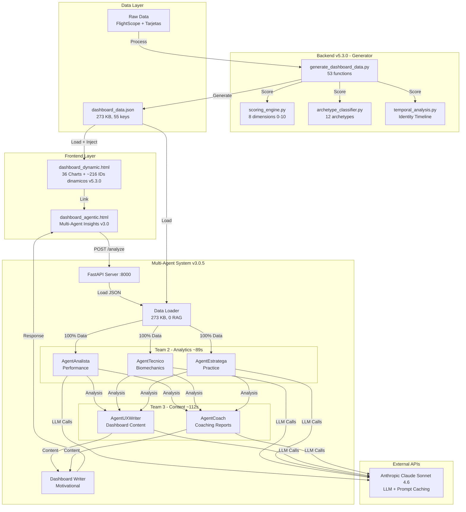

# AlvGolf - Multi-Agent Golf Analytics System

**Version:** v3.0.7 - 100% Dynamic Dashboard (62 JSON keys, ~176 editorial hardcodes migrated)
**Estado:** Production Ready
**Ultima actualizacion:** 2026-03-02

[]()
[]()
[]()
[]()
[]()
[]()

---

## Descripcion del Proyecto

AlvGolf es un sistema completo de analisis de rendimiento de golf potenciado por IA que combina:

1. **Dashboard Dinamico v5.3.0** - 36 visualizaciones interactivas con Chart.js + contenido AI + ~216 valores dinamicos
2. **Backend Generator v5.3.0** - 56 funciones de procesamiento de datos + scoring engine + archetype classifier
3. **Multi-Agent System v3.0.5** - 5 agentes especializados con arquitectura optimizada (asyncio.to_thread)
4. **Identity System** - Scoring Engine (8 dimensiones) + Archetype Classifier (12 arquetipos) + Identity Timeline
5. **Template vs Data** - Dashboard reutilizable: ~216 IDs dinamicos + 7 containers + 7 funciones de inyeccion (extendidas)

### Datos Analizados
- **52 rondas** de golf (Marzo 2024 - Diciembre 2025)
- **497 shots** de FlightScope
- **11 campos** diferentes
- **5 agentes especializados** (Performance, Biomechanics, Practice, UX, Coach)
- **0 RAG queries** (arquitectura optimizada con data_loader)
- **$0.52/mes** costo operacional

---

## Arquitectura del Sistema - Multi-Agent v3.0.5



**Flujo Optimizado (~3.6 minutos):**
1. Data Loader (0.05s) -> Load dashboard_data.json (273 KB)
2. Team 2 Parallel (~89s) -> 3 agents simultaneos (asyncio.to_thread v4.1)
3. Team 3 Parallel (~112s) -> 2 agents simultaneos
4. Dashboard Writer (~13s) -> Output final

---

## What's New

### v3.0.7 - 100% Dynamic Dashboard (2026-03-02)

**~176 hardcodes editoriales migrados a JSON** (LOTES 1-9), completando la dinamizacion al 100%:

- **3 funciones backend nuevas:** `calculate_monthly_recommendations`, `calculate_bubble_analysis`, `calculate_improvement_plan`
- **62 JSON keys** totales (3 nuevas sobre las 59 existentes)
- **Dashboard 100% reutilizable** con cualquier jugador — 0 hardcodes de datos

| LOTE | Tab | Contenido | Hardcodes |
|------|-----|-----------|-----------|
| 1 | Tab 1 | Archetype/Form narratives | ~15 |
| 2 | Meta | PDF filename dinamico | ~5 |
| 3 | Tab 3 | Course dates, insights, patterns | ~15 |
| 4 | Tab 4 | Dispersion stats per club (11 clubs) | ~33 |
| 5 | Tab 4 | Dispersion summary + conclusion | ~18 |
| 6 | Tab 5 | Diagnostic prose + player profile | ~20 |
| 7 | Tab 1 | Coaching recommendations | ~15 |
| 8 | Tab 4 | Bubble analysis (4 zones) | ~25 |
| 9 | Tab 6 | 28-day improvement plan | ~30 |

### v3.0.6 - Template vs Data Phase 2 (2026-03-01)

**~110 hardcodes numericos de alta prioridad migrados a JSON** (LOTES 0-5):

- **3 funciones backend nuevas:** `calculate_form_summary`, `calculate_scoring_streaks`, `calculate_goals_progress`
- **~216 IDs dinamicos** totales (110 nuevos sobre los 106 existentes)
- **12 containers dinamicos** (5 nuevos: DNA compact/expanded, last5, zones, goals)
- **Bug fix critico:** `dispatchDashboardReady` espera `DOMContentLoaded`

| Funcion | Prefijo | IDs | Tab |
|---------|---------|-----|-----|
| `injectPlayerStats()` | `ps-` | 22 + DNA(21) + form/last5(23) + zones(25) | Tab 1 |
| `injectHeaderStats()` | `hd-` | 12 | Header |
| `injectEvolutionStats()` | `ev-` | 24 | Tab 2 |
| `injectCourseStats()` | `cs-` | 17 + narratives(22) + goals + 3 containers | Tab 3 |
| `injectClubStats()` | `cl-` | 14 + 4 containers | Tab 4 |
| `injectAnalysisStats()` | `an-` | 4 + metrics(14) | Tab 5 |
| `injectStrategyStats()` | `st-` | 9 | Tab 6 |

### Template vs Data Phase 1 (2026-02-28)

- **106 IDs dinamicos** iniciales + 7 funciones de inyeccion + 7 containers
- Patron: `<span id="xx-*">fallback</span>` + `set(id, val)` desde JSON
- 11 campos nuevos en `player_stats` del backend

### v3.0.5 - Identity Timeline (2026-02-25)

**Feature:** Timeline visual mostrando evolucion del arquetipo golfistico a lo largo de 18 meses con ventanas deslizantes (90d window, 60d step). 11 periodos generados.

**Nuevos modulos:**
- `app/temporal_analysis.py` (~375 lineas) — analisis temporal con ScoringEngine + ArchetypeClassifier
- `app/scoring_engine.py` — scoring determinista 0-10, 8 dimensiones
- `app/archetype_classifier.py` — 12 arquetipos en 4 familias
- `app/scoring_integration.py` — integracion scoring + archetype + timeline

**Claves JSON nuevas:** `flightscope_shots_timeline` (497 shots), `identity_timeline` (11 periodos), `scoring_profile`, `golf_identity`

### v3.0.4 - Orchestrator asyncio Optimization (2026-02-24)

- `asyncio.to_thread()` para ejecucion paralela real de agentes
- Tiempo total: 5.3 min → ~3.6 min (-33%)
- Arquitectura estatica completa: cero llamadas live al backend desde dashboard
- `ai_content.json` pre-generado y commitado

### v3.0.3 - Static AI Content Cache (2026-02-22)

- Pre-generacion de `output/ai_content.json` para contenido AI instantaneo (<100ms)
- UXWriter skill prompt reducido a 6 secciones requeridas (fix truncacion JSON)
- Fix UnicodeEncodeError en Windows (caracter U+2192)
- Auto-save ai_content.json en endpoints `/generate-content` y `/analyze`

### v3.0.2 - Prompt Caching + Model Update (2026-02-21)

- Prompt caching con `cache_control` en 6 agentes (-90% coste tokens de input)
- Model update: `claude-sonnet-4-20250514` → `claude-sonnet-4-6`
- Structured messages (`SystemMessage` + `HumanMessage`) para compatibilidad caching

### v3.0.1 - UXWriter Dashboard Integration (2026-02-17)

- Nuevo `/generate-content` endpoint en FastAPI
- `loadUXContent()` + `insertUXContent()` (230 lineas JS)
- 6 secciones AI inyectadas en dashboard (hero, DNA, insights, quick wins, ROI, chart titles)
- 8 diagramas Mermaid de arquitectura

### v3.0.0 - Multi-Agent System Complete (2026-02-16)

- 5 agentes especializados: Analista, Tecnico, Estratega, UXWriter, Coach
- Arquitectura optimizada: 0 RAG queries
- LangGraph orchestrator con ejecucion paralela
- Costo: $0.52/mes

---

## Caracteristicas Principales

### Dashboard v5.3.0 (Estatico + Dinamico)
- 36 visualizaciones interactivas con Chart.js
- 6 tabs navegables (Mi Identidad, Evolucion, Campos, Bolsa, Analisis, Estrategia)
- **~216 valores dinamicos** inyectados desde JSON (Template vs Data pattern)
- **12 containers dinamicos** (mejores rondas, quarterly, milestones, carry, matrix)
- Identity Timeline visual (evolucion arquetipo 18 meses)
- Golf Identity Block (scoring radar + archetype)
- Responsive design (iOS/Android optimizado, 360px minimo)
- Export a PDF por tab
- Contenido AI pre-generado (ai_content.json)

### Backend Generator v5.3.0
- 53 funciones de analisis implementadas
- Scoring Engine determinista (8 dimensiones, 0-10)
- Archetype Classifier (12 arquetipos, 4 familias)
- Identity Timeline (ventanas deslizantes 90d/60d)
- Output: dashboard_data.json (273 KB, 55 keys)
- 20 meses de datos historicos

### Multi-Agent System v3.0.5
- 5 agentes especializados en paralelo
- asyncio.to_thread() para ejecucion real paralela
- Prompt caching (-90% coste tokens)
- Claude Sonnet 4.6 (claude-sonnet-4-6)
- Costo: $0.52/mes
- Tiempo total: ~3.6 minutos

### Dashboard IA (Standalone)
- Analisis en 5 dimensiones (Technical, Statistical, Gaps, Recommendations, Prediction)
- UI moderna con animaciones
- Responsive mobile-ready

---

## API Endpoints (v3.0.5)

| Metodo | Path | Proposito | Tiempo |
|--------|------|-----------|--------|
| GET | `/` | Health check | <100ms |
| POST | `/ingest` | Ingesta de datos a Pinecone | ~2s |
| POST | `/query` | RAG query | 10-15s |
| POST | `/analyze` | Workflow completo (5 agentes) | ~3.6 min |
| POST | `/generate-content` | UXWriter content only | ~60-70s |

---

## Instalacion y Configuracion

### Requisitos Previos
- **Python 3.14+** (recomendado 3.14.2)
- **Git** para clonar repositorio
- **Cuentas API:**
    - [Anthropic](https://console.anthropic.com/) (Claude API)
    - [Pinecone](https://www.pinecone.io/) (Vector Database)

### Paso 1: Clonar Repositorio
```bash
git clone https://github.com/AlvGolf/AlvGolf-Identity-EngineV3.git
cd AlvGolf-Identity-EngineV3
```

### Paso 2: Configurar Environment
```bash
cp .env.example .env
# Editar .env con tus API keys
```

**Contenido de .env:**
```
ANTHROPIC_API_KEY=sk-ant-api03-...
PINECONE_API_KEY=pcsk_...
PINECONE_INDEX_NAME=alvgolf-rag
ENV=local
API_HOST=0.0.0.0
API_PORT=8000
LOG_LEVEL=INFO
```

### Paso 3: Instalar Dependencies
```bash
pip install -r requirements.txt
```

### Paso 4: Generar Datos del Dashboard
```bash
python generate_dashboard_data.py
cp output/dashboard_data.json dashboard_data.json
```

### Paso 5: Iniciar Backend (opcional, para agentes IA)
```bash
python -m app.main
```

### Paso 6: Iniciar Frontend Server
```bash
python -m http.server 8001
```

### Paso 7: Acceder
- **Dashboard Principal:** http://localhost:8001/dashboard_dynamic.html
- **GitHub Pages:** https://alvgolf.github.io/AlvGolf-Identity-EngineV3/dashboard_dynamic.html
- **Dashboard IA:** http://localhost:8001/dashboard_agentic.html
- **API Docs:** http://localhost:8000/docs

---

## Estructura del Proyecto

```
AlvGolf/
├── app/                              # Backend Agentic Analytics Engine
│   ├── __init__.py
│   ├── main.py                       # FastAPI app (5 endpoints)
│   ├── config.py                     # Settings management (.env)
│   ├── models.py                     # Pydantic models (12 models)
│   ├── rag.py                        # RAG Core (Pinecone + Claude)
│   ├── scoring_engine.py             # Deterministic scoring (0-10, 8 dims)
│   ├── archetype_classifier.py       # 12 archetypes across 4 families
│   ├── scoring_integration.py        # Scoring + archetype + timeline
│   ├── temporal_analysis.py          # Sliding window identity analysis
│   └── agents/                       # Multi-Agent System
│       ├── __init__.py
│       ├── orchestrator.py           # LangGraph workflow orchestrator
│       ├── analytics_pro.py          # Legacy Analytics Agent (TIER 1)
│       ├── analista.py               # Team 2: Performance (650 lines)
│       ├── tecnico.py                # Team 2: Biomechanics (550 lines)
│       ├── estratega.py              # Team 2: Practice design (600 lines)
│       ├── ux_writer.py              # Team 3: Dashboard content (752 lines)
│       └── coach.py                  # Team 3: Coaching reports (807 lines)
│
├── scripts/                          # Test scripts and utilities
│   ├── test_team3_complete.py        # Team 3 test suite (6 tests)
│   ├── test_optimized_architecture.py
│   ├── test_dashboard_integration.py # E2E tests (4/4)
│   └── ingest_full_data.py           # Data ingestion (120 vectors)
│
├── output/
│   ├── dashboard_data.json           # Generated data (273 KB, 55 keys)
│   └── ai_content.json              # Pre-generated AI content (6 sections)
│
├── data/                             # Raw data
│   ├── flightscope/                  # 497 shots, 11 clubs
│   └── tarjetas/                     # 52 rounds, 11 courses
│
├── dashboard_dynamic.html            # Main dashboard (v5.3.0, ~17,500 lines)
├── dashboard_agentic.html            # AI Insights dashboard
├── index.html                        # Landing page
├── generate_dashboard_data.py        # Backend generator (53 functions)
│
├── .env                              # API keys (NOT committed)
├── .env.example                      # Template
├── requirements.txt                  # Python dependencies
├── ARCHITECTURE_DIAGRAMS.md          # 8 Mermaid architecture diagrams
└── README.md                         # This file
```

---

## Metricas del Sistema

### Performance
| Metrica | Valor |
|---------|-------|
| Dashboard Load | <1s (static HTML) |
| AI Content Load | <100ms (pre-generated) |
| JSON Generation | ~3.1s (53 functions) |
| Full Agent Workflow | ~3.6 min (5 agents) |
| UXWriter Only | ~60-70s |

### Costos (25 analisis/mes)
| Concepto | Costo |
|----------|-------|
| Per-call (sin cache) | $0.185 |
| Per-call (con cache) | $0.110 |
| Pinecone Serverless | ~$0.40/mes |
| **Total Estimado** | **~$0.52/mes** |

### Dataset
| Metrica | Valor |
|---------|-------|
| Rondas Historicas | 52 (Mar 2024 - Dic 2025) |
| Shots FlightScope | 497 (11 clubs) |
| Campos | 11 |
| JSON Keys | 59 |
| JSON Size | 273 KB |
| Dynamic IDs | ~216 (spans + containers) |
| Injection Functions | 7 (extended) |

---

## Roadmap

### Completado

#### v5.0.0 - v5.1.1 (Feb 2026)
- [x] 53 funciones backend
- [x] 36 charts dinamizados (100%)
- [x] Shot zones heatmap (40x50 grid)
- [x] Mobile optimization

#### TIER 1 Agentic (2026-02-15)
- [x] FastAPI backend (5 endpoints)
- [x] RAG System (Pinecone + Claude)
- [x] Analytics Pro Agent

#### v3.0.0 - v3.0.5 (Feb 2026)
- [x] 5 agentes especializados (LangGraph)
- [x] UXWriter dashboard integration
- [x] Prompt caching (-90% coste)
- [x] Static AI cache (ai_content.json)
- [x] asyncio.to_thread optimization (-33% tiempo)
- [x] Scoring Engine (8 dimensiones)
- [x] Archetype Classifier (12 arquetipos)
- [x] Identity Timeline (11 periodos)

#### v3.0.3 (2026-02-22) - Performance + Coach PDF
- [x] Lazy loading de charts por tab (solo renderiza tab activo)
- [x] PDF generation con AgentCoach (informe coaching ~1.500 palabras descargable)
- [x] localStorage caching para contenido AI (TTL 24h)
- [x] Endpoint `/generate-coach` + `generateCoachPDF()` frontend

#### Template vs Data Phase 1 (2026-02-28)
- [x] 106 IDs dinamicos iniciales (Header + 6 Tabs)
- [x] 7 funciones de inyeccion + 7 containers
- [x] Dashboard reutilizable con otro jugador

#### v3.0.6 - Template vs Data Phase 2 (2026-03-01)
- [x] ~110 hardcodes numericos migrados (LOTES 0-5)
- [x] 3 funciones backend nuevas (form_summary, scoring_streaks, goals_progress)
- [x] ~216 IDs dinamicos totales + 12 containers
- [x] DOMContentLoaded fix para localStorage cache race condition

#### v3.0.7 - 100% Dynamic Dashboard (2026-03-02)
- [x] ~176 hardcodes editoriales migrados (LOTES 1-9)
- [x] 3 funciones backend nuevas (monthly_recommendations, bubble_analysis, improvement_plan)
- [x] 62 JSON keys, 273 KB — dashboard 100% dinamico
- [x] Tabs 1, 3, 4, 5, 6 enriquecidos con narrativas, diagnosticos, planes

### Pendiente
- [ ] Multi-usuario (escalabilidad)

---

## Changelog

### v3.0.7 (2026-03-02) - 100% Dynamic Dashboard
- LOTES 1-9: ~176 hardcodes editoriales migrados a JSON
- 3 funciones backend: `calculate_monthly_recommendations`, `calculate_bubble_analysis`, `calculate_improvement_plan`
- Tab 1: Narrativas arquetipo/forma + recomendaciones coaching
- Tab 3: Fechas HCP, insights campos, patron mejores rondas
- Tab 4: Stats dispersion 11 clubs + summary 3 categorias + bubble analysis 4 zonas
- Tab 5: Diagnosticos long/mid/short game + perfil jugador
- Tab 6: Plan mejora 28 dias (metricas + semanas + criterios exito)
- Total: 62 JSON keys, 273 KB, dashboard 100% dinamico

### v3.0.6 (2026-03-01) - Template vs Data Phase 2
- LOTES 0-5: ~110 hardcodes numericos migrados a JSON
- 3 funciones backend: `calculate_form_summary`, `calculate_scoring_streaks`, `calculate_goals_progress`
- 5 containers nuevos: DNA compact/expanded, last5 rounds, distance zones, goals progress
- 22 spans narrativos Tab 3 (HCP historia, insights, quarterly, versiones, rachas, prediccion)
- 14 spans Tab 5 (GIR%, game categories, ball/club speed, driver bias)
- Bug fix: `dispatchDashboardReady` espera `DOMContentLoaded` (race condition localStorage)
- Total: ~216 IDs dinamicos, 12 containers, 59 JSON keys

### Template vs Data Phase 1 (2026-02-28)
- 106 IDs dinamicos: `ps-*` (22), `hd-*` (12), `ev-*` (24), `cs-*` (17+3), `cl-*` (14+4), `an-*` (4), `st-*` (9)
- 7 funciones JS de inyeccion + 7 containers dinamicos
- Backend: 11 campos nuevos en `player_stats` + helper `_months_between()`

### v3.0.5 (2026-02-25) - Identity Timeline
- `temporal_analysis.py` — sliding window 90d/60d, 11 periodos
- `scoring_engine.py` + `archetype_classifier.py` — scoring 0-10 + 12 arquetipos
- Visualizacion Identity Timeline en dashboard
- Cache fix: `window.dashboardData = fresh` siempre

### v3.0.4 (2026-02-24) - Async Optimization
- `asyncio.to_thread()` en orchestrator (-33% tiempo total)
- Arquitectura 100% estatica (cero llamadas live)

### v3.0.3 (2026-02-22) - Lazy Loading + Coach PDF + Static AI Cache
- Lazy loading de charts por tab (`ENABLE_LAZY_LOADING`, `lazyInit` en `showTab()`)
- `generateCoachPDF()` + `buildCoachReportHTML()` — informe coaching descargable en PDF
- Boton `coach-pdf` en menu rapido de 6 tabs + toast de progreso
- `ai_content.json` pre-generado y commitado (6 secciones + coach_report)
- `window.coachReportMd` carga desde ai_content.json (PDF sin backend)
- UXWriter 6-section fix (eliminar secciones no usadas del prompt)
- Windows encoding fix

### v3.0.2 (2026-02-21) - Prompt Caching
- `cache_control` en 6 agentes (-90% coste input tokens)
- Model update a `claude-sonnet-4-6`

### v3.0.1 (2026-02-17) - UXWriter Integration
- `/generate-content` endpoint
- Frontend JS: `loadUXContent()` + `insertUXContent()`
- 6 secciones AI en dashboard
- 8 diagramas Mermaid

### v3.0.0 (2026-02-16) - Multi-Agent System
- 5 agentes especializados con LangGraph
- Arquitectura 0 RAG queries
- $0.52/mes

### v5.1.1 (2026-02-13) - Heatmap + Mobile
### v5.1.0 (2026-02-12) - 10D Radar
### v5.0.0 (2026-02-09) - 36 Charts (100%)
### TIER 1 (2026-02-15) - FastAPI + RAG + Agent

---

## Seguridad

- **NO COMMIT** `.env` a Git (API keys)
- CORS configurado para localhost
- Datos personales no compartidos externamente
- Vector DB con namespace aislado (`alvaro`)

---

## Contacto & Links

**Proyecto:** AlvGolf Multi-Agent Golf Analytics System
**Developer:** Alvaro Peralta
**Asistido por:** Claude Sonnet 4.6 / Claude Opus 4.6 (Anthropic)
**GitHub:** https://github.com/AlvGolf/AlvGolf-Identity-EngineV3
**GitHub Pages:** https://alvgolf.github.io/AlvGolf-Identity-EngineV3/

---

## Licencia

Proyecto personal - Todos los derechos reservados Alvaro Peralta 2026

---

**Ultima actualizacion:** 2 de marzo de 2026
**Estado:** Production Ready
**Version:** v3.0.7 - 100% Dynamic Dashboard (62 JSON keys, ~176 editorial hardcodes migrated)
