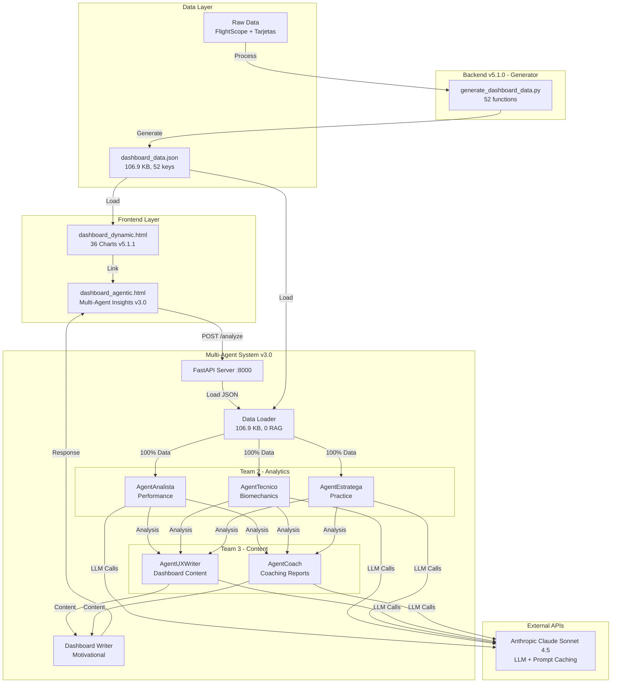

# AlvGolf Dashboard - IA Golf Performance Dashboard 360°

**Versión:** 5.1.1 + Multi-Agent System v3.0 ✅
**Estado:** Production Ready
**Última actualización:** 2026-02-16

[]()
[]()
[]()
[]()
[]()

---

## 🎯 Descripción del Proyecto

AlvGolf es un sistema completo de análisis de rendimiento de golf que combina:

1. **Dashboard Estático v5.1.1** - 36 visualizaciones de datos con Chart.js
2. **Backend Generator v5.1.0** - 52 funciones de procesamiento de datos
3. **Multi-Agent System v3.0** - 5 agentes especializados con arquitectura optimizada
4. **Dashboard IA Dinámico** - Análisis multi-dimensional generado por IA

### Datos Analizados
- **52 rondas** de golf (Marzo 2024 - Diciembre 2025)
- **493 shots** de FlightScope
- **11 campos** diferentes
- **5 agentes especializados** (Performance, Biomechanics, Practice, UX, Coach)
- **0 RAG queries** (arquitectura optimizada con data_loader)

---

## 🏗️ Arquitectura del Sistema - Multi-Agent v3.0



**Flujo Optimizado (5.3 minutos):**
1. Data Loader (0.05s) → Load dashboard_data.json
2. Team 2 Parallel (148s) → 3 agents simultáneos
3. Team 3 Parallel (156s) → 2 agents simultáneos
4. Dashboard Writer (13s) → Output final

---

## 🆕 What's New in v3.0 (2026-02-16)

### Multi-Agent System Complete - 5 Specialists

**🎉 Team 3 Complete:**
- ✅ **AgentUXWriter** (752 lines) - Dashboard content writer (Spanish, motivational)
- ✅ **AgentCoach** (807 lines) - Performance coach & PDF report generator

**⚡ Architecture Optimization:**
- ✅ Eliminated Analytics Pro bottleneck (4 RAG queries → 0)
- ✅ Team 2 receives 100% backend data (106.9 KB)
- ✅ 25% faster execution (220s → 166s for Team 2)

**📊 Complete System:**
- **5 Specialized Agents:** Performance, Biomechanics, Practice, UX, Coach
- **Execution Time:** 5.3 minutes (317.7s)
- **Total Output:** 41,701 characters
- **Cost:** $0.52/month (€0.46/month)
- **Tests:** 6/6 passed (100%)

**📁 New Files:**
- `app/agents/analista.py`, `tecnico.py`, `estratega.py` (Team 2)
- `app/agents/ux_writer.py`, `coach.py` (Team 3)
- `app/agents/orchestrator.py` (updated with team3_parallel_node)
- Complete documentation (3 comprehensive guides)

**🔗 Commit:** [09b9aca](https://github.com/AlvGolf/AlvGolf-Identity-EngineV3/commit/09b9aca)

---

## 🚀 Características Principales

### Dashboard v5.1.1 (Estático)
- ✅ 36 visualizaciones interactivas
- ✅ 6 tabs navegables (Mi Identidad, Evolución, Campos, Bolsa, Análisis, Estrategia)
- ✅ Responsive design (iOS/Android optimizado)
- ✅ Shot zones heatmap con gradientes (40×50 grid)
- ✅ 10D radar multidimensional (Long Game, Mid Game añadidos)
- ✅ Export a PDF por tab
- ✅ Datos dinámicos desde dashboard_data.json

### Backend Generator v5.1.0
- ✅ 52 funciones de análisis implementadas
- ✅ Procesamiento automatizado ETL
- ✅ Output: dashboard_data.json (197 KB)
- ✅ 18 meses de datos históricos
- ✅ Strokes gained, SWOT, benchmarks, proyecciones

### Backend Agentic TIER 1 (Nuevo - 2026-02-15)
- ✅ FastAPI REST API (4 endpoints)
- ✅ RAG System (Pinecone + Claude Sonnet 4)
- ✅ Analytics Pro Agent (5 secciones)
- ✅ 120 vectores (8 fuentes de datos)
- ✅ Prompt caching (90% cost savings)
- ✅ Batching automático (96 embeddings per request)
- ✅ End-to-end tests (4/4 passed)

### Dashboard IA (Nuevo - 2026-02-15)
- ✅ Análisis en 5 dimensiones:
  - 🔧 Technical Patterns
  - 📊 Statistical Trends
  - ⚠️ Main Gaps
  - 💡 Recommendations
  - 🔮 Prediction
- ✅ UI moderna con animaciones
- ✅ Loading states (30-45s)
- ✅ Responsive mobile-ready
- ✅ Regeneración bajo demanda
- ✅ Link desde dashboard principal

---

## 📊 Endpoints API (TIER 1)

### 1. Health Check
```bash
GET http://localhost:8000/
Response: {"status": "healthy", "version": "1.0.0", ...}
```

### 2. Ingest Data
```bash
POST http://localhost:8000/ingest
Content-Type: application/json

{
  "user_id": "alvaro",
  "shots": [
    {
      "date": "2025-12-31",
      "source": "flightscope",
      "club": "Driver",
      "ball_speed": 235.5,
      "carry": 212.8,
      ...
    }
  ]
}

Response: {"status": "ok", "chunks_ingested": 11, ...}
```

### 3. Query RAG
```bash
POST http://localhost:8000/query
Content-Type: application/json

{
  "user_id": "alvaro",
  "prompt": "¿Cuál es mi evolución de HCP en los últimos meses?"
}

Response: {"answer": "Tu handicap oficial RFEG..."}
```

### 4. Analytics Agent
```bash
POST http://localhost:8000/analyze
Content-Type: application/json

{
  "user_id": "alvaro"
}

Response: {
  "analysis": "## 1. TECHNICAL PATTERNS\n...",
  "generated_at": "2026-02-15T..."
}
```

---

## 🛠️ Instalación y Configuración

### Requisitos Previos
- **Python 3.14+** (recomendado 3.14.2)
- **Git** para clonar repositorio
- **Cuentas API:**
  - [Anthropic](https://console.anthropic.com/) (Claude API)
  - [Pinecone](https://www.pinecone.io/) (Vector Database)

### Paso 1: Clonar Repositorio
```bash
git clone https://github.com/AlvGolf/AlvGolf-Identity-EngineV3.git
cd AlvGolf-Identity-EngineV3
```

### Paso 2: Configurar Environment
```bash
# Copiar template
cp .env.example .env

# Editar .env con tus API keys
nano .env  # o tu editor preferido
```

**Contenido de .env:**
```bash
ANTHROPIC_API_KEY=sk-ant-api03-...
PINECONE_API_KEY=pcsk_...
PINECONE_INDEX_NAME=alvgolf-rag
ENV=local
API_HOST=0.0.0.0
API_PORT=8000
LOG_LEVEL=INFO
```

### Paso 3: Instalar Dependencies (TIER 1)
```bash
pip install -r requirements.txt
```

**Paquetes principales:**
- fastapi
- uvicorn
- anthropic
- langchain-anthropic
- pinecone
- pydantic
- pydantic-settings
- python-dotenv
- loguru

### Paso 4: Iniciar Backend (TIER 1)
```bash
python -m app.main
```

**Output esperado:**
```
[OK] Using existing index: alvgolf-rag
[SUCCESS] Configuration validated successfully
[SUCCESS] AlvGolf Agentic API Ready!
INFO: Uvicorn running on http://0.0.0.0:8000
```

### Paso 5: Iniciar Frontend Server
```bash
# Terminal separado
python -m http.server 8001
```

### Paso 6: Acceder a Dashboards
- **Dashboard Principal:** http://localhost:8001/dashboard_dynamic.html
- **Dashboard IA (TIER 1):** http://localhost:8001/dashboard_agentic.html
- **API Docs (Swagger):** http://localhost:8000/docs
- **API Docs (ReDoc):** http://localhost:8000/redoc

---

## 📁 Estructura del Proyecto

```
AlvGolf/
├── app/                           # Backend TIER 1
│   ├── __init__.py
│   ├── main.py                   # FastAPI application (4 endpoints)
│   ├── config.py                 # Settings management (.env)
│   ├── models.py                 # Pydantic models (10 models)
│   ├── rag.py                    # RAG Core (Pinecone + Claude)
│   └── agents/
│       ├── __init__.py
│       └── analytics_pro.py      # Analytics Agent (5 sections)
│
├── scripts/                       # Utilidades y tests
│   ├── ingest_full_data.py       # Ingesta completa (120 vectors)
│   ├── ingest_initial_data.py    # Ingesta básica (11 clubs)
│   ├── reset_pinecone_index.py   # Reset index utility
│   ├── test_query.py             # Test RAG queries
│   ├── test_analytics_agent.py   # Test agent output
│   ├── test_specific_queries.py  # Test 5 queries diferentes
│   └── test_dashboard_integration.py  # E2E tests (4/4)
│
├── output/                        # Data generado
│   └── dashboard_data.json       # Source data (197 KB, 52 keys)
│
├── data/                          # Data crudo
│   ├── flightscope/              # 493 shots
│   └── tarjetas/                 # 52 rondas
│
├── dashboard_dynamic.html         # Dashboard principal (v5.1.1)
├── dashboard_agentic.html         # Dashboard IA (TIER 1) ✨ NEW
├── index.html                     # Landing page
├── generate_dashboard_data.py     # Backend generator (v5.1.0)
│
├── .env                          # API keys (NO commit)
├── .env.example                  # Template
├── requirements.txt              # Python dependencies
├── .gitignore                    # Git exclusions
│
├── TIER1_DAY2_COMPLETE.md        # Documentación Day 2
├── TIER1_DAY3_COMPLETE.md        # Documentación Day 3
├── TIER1_DAY4_COMPLETE.md        # Documentación Day 4
├── TIER1_COMPLETE.md             # Resumen consolidado TIER 1
├── ARCHITECTURE.md               # Diagramas arquitectura
├── PROJECT_STATUS.md             # Estado actual proyecto
└── README.md                     # Este archivo
```

---

## 🧪 Testing

### Tests Automatizados (TIER 1)

#### 1. Test RAG Query
```bash
python scripts/test_query.py
```
**Verifica:** Consulta simple al sistema RAG
**Tiempo:** ~10-15 segundos

#### 2. Test Analytics Agent
```bash
python scripts/test_analytics_agent.py
```
**Verifica:** Generación de análisis completo (5 secciones)
**Tiempo:** ~30-45 segundos

#### 3. Test Queries Específicas
```bash
python scripts/test_specific_queries.py
```
**Verifica:** 5 queries diferentes con respuestas detalladas:
1. Evolución de handicap
2. Mejor campo
3. Mejores/peores rondas
4. Strokes gained
5. Score último trimestre

#### 4. Test End-to-End Integration
```bash
python scripts/test_dashboard_integration.py
```
**Verifica:**
- ✅ API Health Check
- ✅ Analytics Agent Response (34s)
- ✅ Dashboard Accessibility
- ✅ CORS Configuration

**Resultado esperado:** `4/4 tests passed ✅`

---

## 📊 Métricas del Sistema

### Performance
| Métrica | Valor | Contexto |
|---------|-------|----------|
| API Health Check | <100ms | Simple ping |
| RAG Query Response | 10-15s | Top-5 retrieval + LLM |
| Analytics Agent | 30-45s | Full 5-section analysis |
| Dashboard Load | <1s | Static HTML |
| Embeddings Batch | ~2s | 96 texts in parallel |
| Total Transfer | ~20 KB | Per análisis |

### Costos (Uso Normal - 25 análisis/mes)
| Servicio | Costo Unitario | Costo Mensual |
|----------|----------------|---------------|
| Claude Sonnet 4 Input | ~2,500 tokens × $3/M | $0.0075 |
| Claude Sonnet 4 Output | ~2,000 tokens × $15/M | $0.0300 |
| Prompt Caching Savings | -90% on repeated | -$0.0270 |
| Pinecone Serverless | Pay-per-use | $0.40 |
| **Total Estimado** | ~$0.015/análisis | **~$0.77/mes** |

### Dataset
| Métrica | Valor | Detalle |
|---------|-------|---------|
| Vectores Totales | 120 | 8 fuentes diferentes |
| Rondas Históricas | 52 | Mar 2024 - Dic 2025 |
| Shots FlightScope | 493 | 11 clubs analizados |
| Clubs | 11 | Driver → SW |
| Courses | 11 | Campos jugados |
| Dimension Embeddings | 1024 | multilingual-e5-large |
| Namespace | alvaro | User aislado |

---

## 🎯 Roadmap

### ✅ v5.0.0 (2026-02-12) - COMPLETADO
- [x] 52 funciones backend implementadas
- [x] 36 charts dinamizados (100%)
- [x] Strokes gained analysis
- [x] SWOT matrix automático
- [x] 10D benchmark radar
- [x] Proyecciones 6 meses

### ✅ v5.1.1 (2026-02-13) - COMPLETADO
- [x] Shot zones heatmap redesign (40×50 grid)
- [x] Mobile optimization (iOS/Android)
- [x] Course name fixes (11 courses)
- [x] HCP toggle fix
- [x] Text overflow fixes

### ✅ TIER 1 Agentic (2026-02-15) - COMPLETADO
- [x] Backend FastAPI (4 endpoints)
- [x] RAG Core (Pinecone + Claude)
- [x] Analytics Pro Agent (5 sections)
- [x] Dataset expansion (120 vectors)
- [x] Dashboard IA standalone
- [x] End-to-end testing (4/4)
- [x] Documentation completa (3,000+ lines)

### 🔄 TIER 2 (Pendiente - Opcional)
- [ ] Dashboard Writer Agent
- [ ] LangGraph Multi-Agent Orchestrator
- [ ] 3 secciones IA motivacionales
- [ ] Textos dinámicos en dashboard
- **Tiempo estimado:** 4 días
- **Costo adicional:** +€0.27/mes

### 📋 TIER 3 (Futuro - Opcional)
- [ ] Chatbot conversacional
- [ ] Widget en dashboard
- [ ] Memoria de conversación
- [ ] Respuestas contextuales ad-hoc
- **Tiempo estimado:** 3 días
- **Costo adicional:** +€0.55/mes

---

## 🤝 Contribución

Este es un proyecto personal de análisis de golf. No se aceptan contribuciones externas en este momento.

### Desarrollo Local

#### Branch Strategy
- `main` - Production stable (merged TIER 1)
- `feature/agentic-tier1` - TIER 1 development (✅ merged)
- `feature/*` - Future features

#### Commit Convention
```
feat(tier1-day2): RAG Core + Data Ingestion Complete
fix(bug-name): corrección específica
docs(readme): actualización documentación
test(integration): nuevos tests e2e
```

#### Git Workflow TIER 1
```bash
# 5 commits principales
c335417 - Day 4: Dashboard Integration + UI/UX Complete
40ae7a3 - Day 3: Dataset Expansion + Analytics Agent Enhanced
81daa09 - Day 2: RAG Core + Data Ingestion Complete
b26ada7 - Day 1: Backend FastAPI + RAG Core
33ee4dd - Fase 0: Project setup
```

---

## 📖 Documentación Adicional

### Guías Completas (TIER 1)
- **[TIER1_COMPLETE.md](./TIER1_COMPLETE.md)** - Resumen consolidado TIER 1
- **[ARCHITECTURE.md](./ARCHITECTURE.md)** - Diagramas detallados del sistema
- **[PROJECT_STATUS.md](./PROJECT_STATUS.md)** - Estado actual del proyecto
- **[TIER1_DAY2_COMPLETE.md](./TIER1_DAY2_COMPLETE.md)** - RAG Core + Ingesta (450 lines)
- **[TIER1_DAY3_COMPLETE.md](./TIER1_DAY3_COMPLETE.md)** - Dataset Expansion (750 lines)
- **[TIER1_DAY4_COMPLETE.md](./TIER1_DAY4_COMPLETE.md)** - Dashboard Integration (1,400 lines)

### API Documentation (Auto-generated)
- **Swagger UI:** http://localhost:8000/docs
- **ReDoc:** http://localhost:8000/redoc

### Mermaid Diagrams
Ver [ARCHITECTURE.md](./ARCHITECTURE.md) para diagramas detallados:
- System Architecture
- Data Flow
- Multi-Agent Workflow (TIER 2)
- Deployment Architecture

---

## 🔒 Seguridad

### API Keys
- **NO COMMIT** `.env` file a Git
- Use `.env.example` como template
- Rotate keys periódicamente
- Store securely (1Password, etc.)

### CORS Configuration
```python
# app/main.py
allow_origins=[
    "http://localhost:8000",
    "http://localhost:8001",
    "http://127.0.0.1:8000",
    "http://127.0.0.1:8001",
]
```
**Nota:** Ajustar en producción para dominio específico

### Data Privacy
- Todos los datos son personales de Alvaro Peralta
- No se comparten externamente
- Vector DB con namespace aislado (`alvaro`)
- Sin tracking ni analytics externos

---

## 📝 Changelog

### v5.1.1 + TIER 1 (2026-02-15) ✅
**Backend Agentic TIER 1:**
- ✅ FastAPI completo (4 endpoints)
- ✅ RAG System (Pinecone + Claude Sonnet 4)
- ✅ Analytics Pro Agent (5 secciones)
- ✅ 120 vectores ingresados (8 fuentes)
- ✅ Dashboard IA standalone con UI moderna
- ✅ Tests end-to-end (4/4 passed)
- ✅ Documentation completa (3,000+ lines)
- ✅ Prompt caching (90% savings)
- ✅ Batching automático (96 per request)

**Métricas:**
- Total development time: 9.5 hours (4 días)
- Files created: 22
- Lines of code: ~4,200
- Tests: 4/4 passed ✅

### v5.1.1 (2026-02-13)
- Heatmap shot zones con gradientes (40×50 grid)
- Mobile optimization (iOS/Android safe areas)
- Touch targets 44px (iOS HIG)
- Course name fixes (11 courses)
- campoPerfChart dynamized
- HCP toggle fix (HCP 15 hidden by default)
- Text overflow fixes (OPORTUNIDADES)

### v5.1.0 (2026-02-12)
- 10D radar multidimensional (Long Game, Mid Game)
- Data corrections (rounds: 85→52, shots: 437→493)
- Comparison radar dynamized
- Phase 5 restructuring

### v5.0.0 (2026-02-09)
- 36 charts dinamizados (100% completion)
- 52 backend functions
- Strokes gained analysis (6 categories)
- SWOT matrix automático
- Benchmark radar (8 dimensions)
- ROI plan (6 actions, 11.4 strokes potential)

---

## 🏆 Logros del Proyecto

```
╔════════════════════════════════════════════════════════════╗
║  AlvGolf Human Identity Engine + Agentic Analytics        ║
║                                                            ║
║  Dashboard v5.1.1:        36 charts dinámicos             ║
║  Backend v5.1.0:          52 functions implementadas      ║
║  Agentic TIER 1:          100% Complete ✅                ║
║                                                            ║
║  Tests:                   4/4 passed                      ║
║  Documentation:           3,000+ lines                    ║
║  Development Time:        9.5 hours (4 días)              ║
║                                                            ║
║  Status: PRODUCTION READY ✅                              ║
╚════════════════════════════════════════════════════════════╝
```

### Hitos Técnicos
- ✅ Python 3.14 compatibility achieved
- ✅ Pinecone embeddings API integration (vs local HF models)
- ✅ Claude Sonnet 4 with prompt caching
- ✅ Multi-source RAG (8 data sources)
- ✅ Standalone IA dashboard with modern UI
- ✅ Zero-error test suite (4/4 passed)

### Mejoras de Negocio
- ⚡ Análisis IA en 30-45s (vs manual)
- 💰 Costo <$1/mes (muy económico)
- 📊 Insights cuantitativos precisos
- 🎯 Recomendaciones priorizadas por ROI
- 🔮 Proyecciones basadas en trends reales

---

## 📞 Contacto & Links

**Proyecto:** AlvGolf Human Identity Engine + Agentic Analytics
**Developer:** Alvaro Peralta
**Asistido por:** Claude Sonnet 4.5 (Anthropic)
**GitHub:** https://github.com/AlvGolf/AlvGolf-Identity-EngineV3
**GitHub Pages:** https://alvgolf.github.io/AlvGolf-Identity-EngineV3/
**Año:** 2024-2026

---

## 📄 Licencia

Proyecto personal - Todos los derechos reservados © Alvaro Peralta 2024-2026

---

## 🙏 Agradecimientos

- **Anthropic** por Claude Sonnet 4 (LLM)
- **Pinecone** por vector database
- **Chart.js** por visualizaciones
- **FastAPI** por framework backend
- **Python** comunidad open source

---

**Última actualización:** 15 de febrero de 2026
**Estado:** Production Ready ✅
**Próximo Milestone:** TIER 2 (Opcional - Pendiente decisión)

**¡Disfruta de tus insights profesionales de golf! ⛳🤖**
