# AlvGolf v3.0.1 — Referencia Visual Completa

**Versión:** 3.0.1 · **Fecha:** 2026-02-20 · **Estado:** ✅ Producción Estable

> Todos los diagramas del proyecto en un único archivo.
> GitHub renderiza Mermaid automáticamente. También funciona en VS Code con la extensión *Markdown Preview Mermaid Support*.

---

## Índice

| # | Sección | Tema |
|---|---------|------|
| [1](#1-arquitectura-completa-del-sistema) | Arquitectura Completa | Sistema end-to-end v3.0.1 |
| [2](#2-flujo-multi-agente) | Flujo Multi-Agente | Orquestación LangGraph, Teams 2 y 3 |
| [3](#3-integración-uxwriter--dashboard) | Integración UXWriter | Sequence + States del contenido IA |
| [4](#4-api-y-endpoints) | API y Endpoints | FastAPI, rutas, dependencias |
| [5](#5-backend-etl--flujo-de-datos) | Backend ETL | Flujo simplificado, funciones, dependencias |
| [6](#6-frontend-dashboard) | Frontend Dashboard | Inicialización de charts, safety pattern, error handling |
| [7](#7-deployment) | Deployment | Arquitectura local y GitHub Pages |
| [8](#8-performance-y-costos) | Performance y Costos | Métricas ETL, multi-agent, costos Claude |
| [9](#9-timeline-del-proyecto) | Timeline Sprints | Gantt Fase 1, 2 y 3 completo |
| [10](#10-troubleshooting-y-acceso) | Troubleshooting y Acceso | CORS, árbol de decisión de acceso |

---

## 1. Arquitectura Completa del Sistema

> *Fuente: `ARCHITECTURE_DIAGRAMS.md` — Diagrama 1*

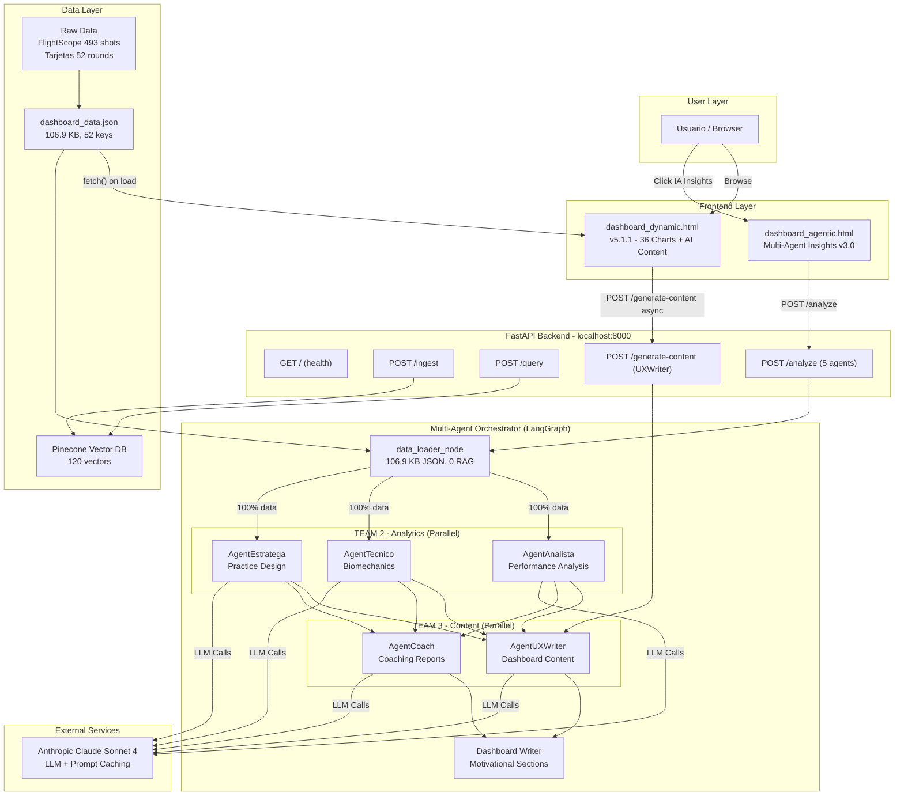

---

## 2. Flujo Multi-Agente

### 2.1 Orquestación por Fases

> *Fuente: `ARCHITECTURE_DIAGRAMS.md` — Diagrama 4*

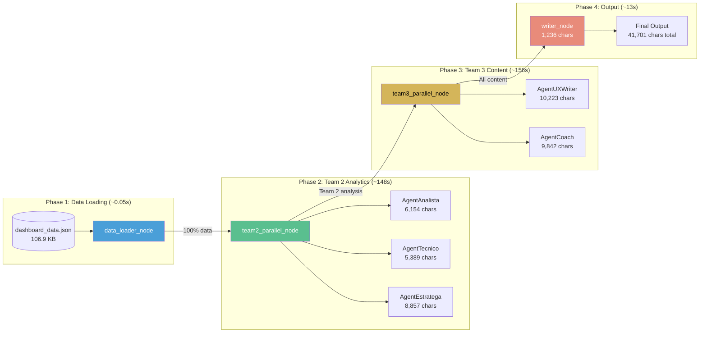

### 2.2 Dependencias de Funciones Backend

> *Fuente: `MERMAID_DIAGRAMS.md` — Diagrama 11*

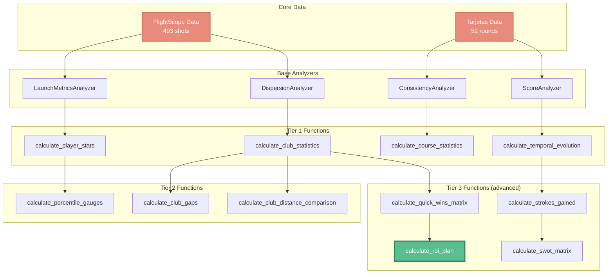

---

## 3. Integración UXWriter → Dashboard

### 3.1 Secuencia de Carga

> *Fuente: `ARCHITECTURE_DIAGRAMS.md` — Diagrama 2*

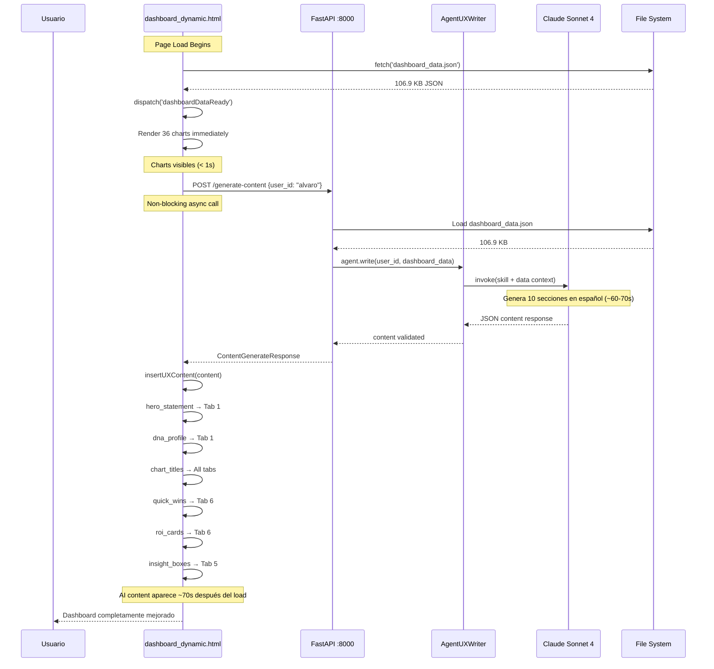

### 3.2 Ciclo de Vida del Contenido IA

> *Fuente: `ARCHITECTURE_DIAGRAMS.md` — Diagrama 3*

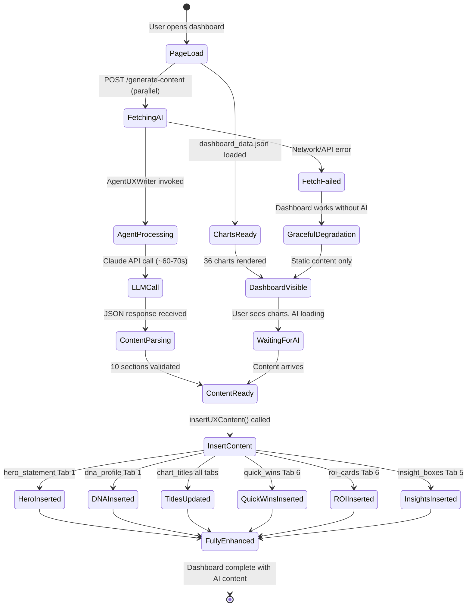

---

## 4. API y Endpoints

> *Fuente: `ARCHITECTURE_DIAGRAMS.md` — Diagrama 7*

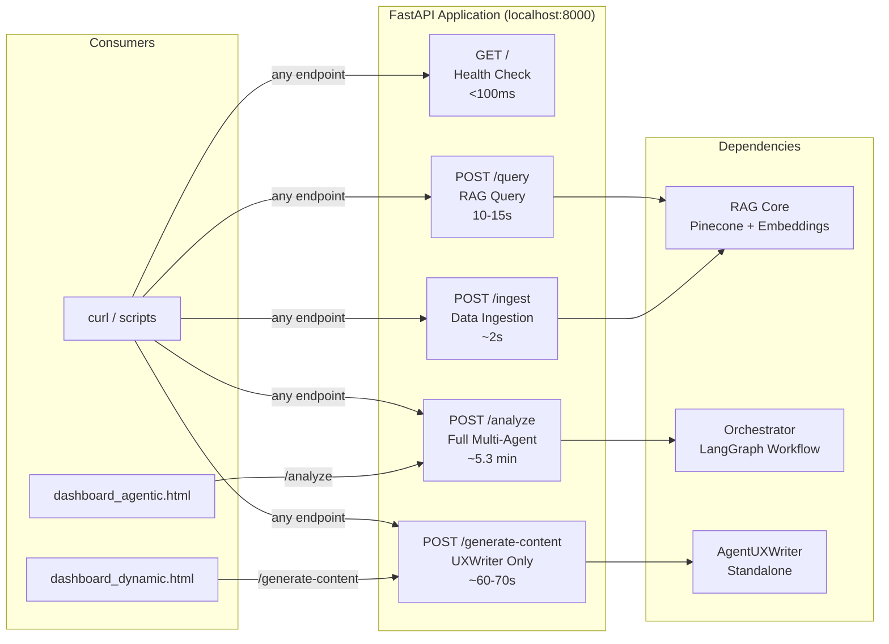

---

## 5. Backend ETL — Flujo de Datos

### 5.1 Flujo Simplificado (visión de usuario)

> *Fuente: `data-flow-simplified.md`*

```mermaid
flowchart LR
    subgraph INPUT["📥 ENTRADA: Tus Datos"]
        EXCEL1[FlightScope Excel<br/>493 shots de práctica<br/>Distancia, velocidad, altura]
        EXCEL2[Tarjetas Excel<br/>52 rondas jugadas<br/>Scores por hoyo]
    end

    subgraph PROCESS["⚙️ PROCESAMIENTO: Motor ETL"]
        ETL[generate_dashboard_data.py v5.1.0<br/><br/>52 funciones de análisis:<br/>Launch metrics · Dispersión<br/>Consistencia · Trends<br/>Motor 10 Dimensiones<br/><br/>⏱️ 3.1 segundos]
    end

    subgraph OUTPUT["📤 SALIDA"]
        JSON[dashboard_data.json<br/>106.9 KB<br/>52 keys]
    end

    subgraph VISUAL["🎨 VISUALIZACIÓN"]
        DASHBOARD[Dashboard HTML v5.1.1<br/>36 visualizaciones dinámicas<br/>6 tabs principales]
    end

    EXCEL1 --> ETL
    EXCEL2 --> ETL
    ETL -->|Genera en 3.1s| JSON
    JSON -->|fetch()| DASHBOARD

    style PROCESS fill:#d4edda,stroke:#28a745,stroke-width:3px
    style OUTPUT fill:#fff3cd,stroke:#ffc107,stroke-width:2px
```

### 5.2 Flujo Multi-Agente IA (extensión opcional)

> *Fuente: `data-flow-simplified.md` — sección v3.0.1*

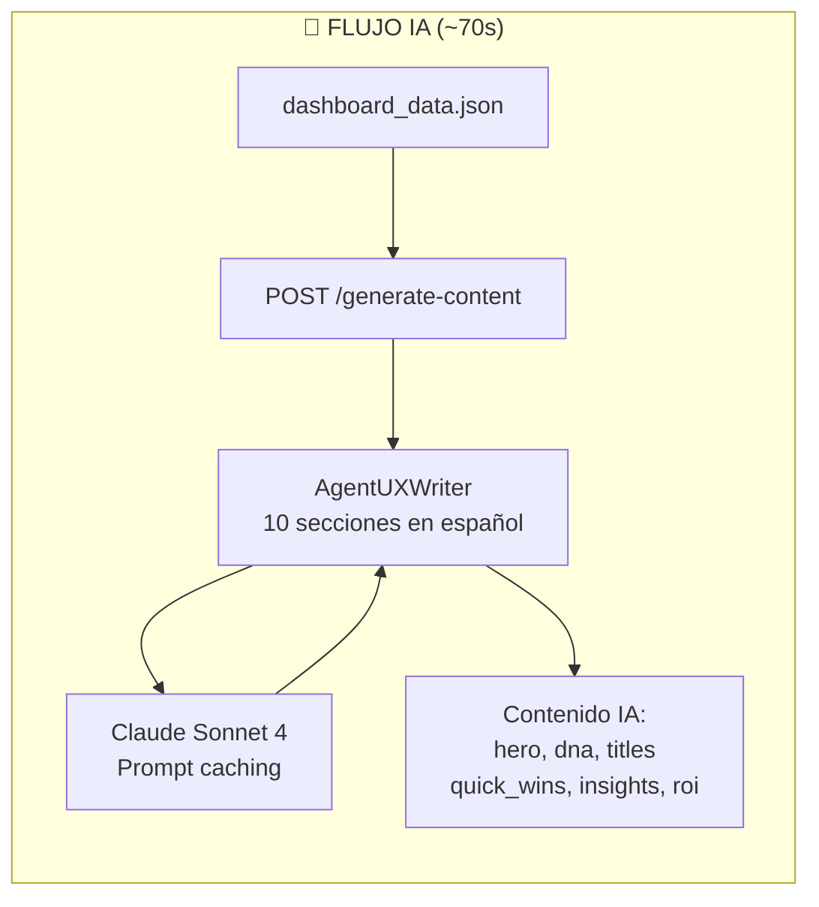

### 5.3 Workflow Diario (paso a paso)

> *Fuente: `data-flow-simplified.md`*

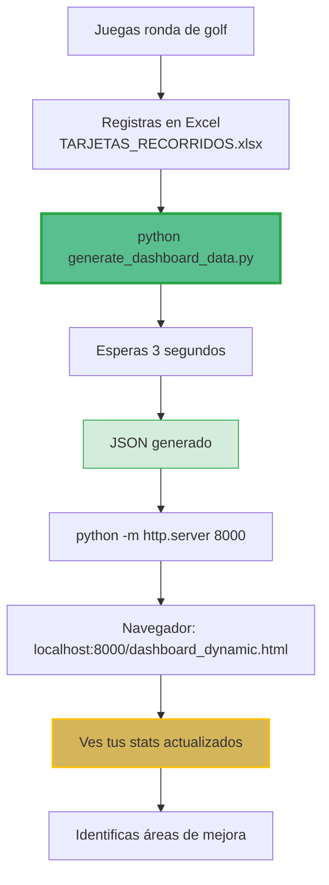

---

## 6. Frontend Dashboard

### 6.1 Secuencia de Inicialización de Charts

> *Fuente: `MERMAID_DIAGRAMS.md` — Diagrama 3*

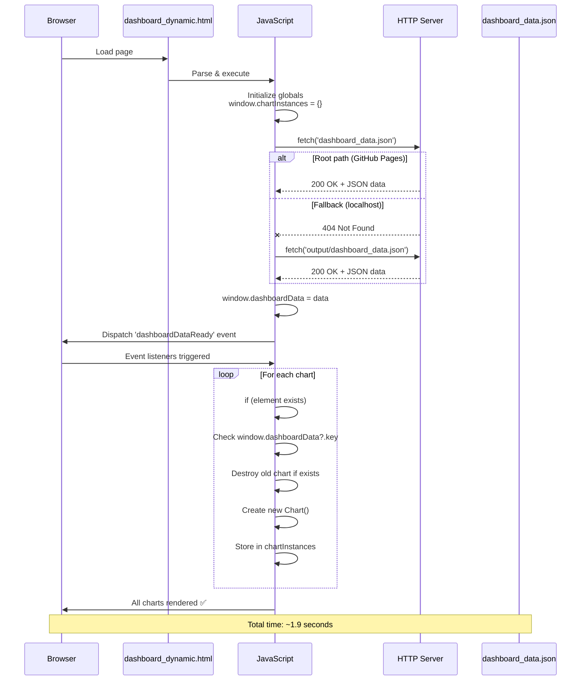

### 6.2 Safety Pattern (prevención de errores)

> *Fuente: `MERMAID_DIAGRAMS.md` — Diagrama 4*

```mermaid
flowchart TD
    START([Chart Initialization]) --> CHECK_ELEMENT{Element exists?}

    CHECK_ELEMENT -->|No| SKIP[Skip chart initialization]
    CHECK_ELEMENT -->|Yes| INIT_GLOBAL[window.chartInstances = {} || {}]

    INIT_GLOBAL --> CHECK_INSTANCE{Chart instance exists?}

    CHECK_INSTANCE -->|Yes| DESTROY[Destroy old chart:<br/>chartInstances.chart.destroy]
    CHECK_INSTANCE -->|No| CHECK_DATA

    DESTROY --> CHECK_DATA{Data available?}

    CHECK_DATA -->|No| USE_FALLBACK[Use hardcoded fallback:<br/>data || defaultData]
    CHECK_DATA -->|Yes| EXTRACT_DATA[Extract from JSON:<br/>window.dashboardData?.key]

    USE_FALLBACK --> CREATE_CHART
    EXTRACT_DATA --> CREATE_CHART[Create Chart.js instance]

    CREATE_CHART --> STORE[Store reference:<br/>chartInstances.chart = new Chart]
    STORE --> END([Chart Ready ✅])
    SKIP --> END

    style START fill:#5ABF8F,stroke:#3A7F5F,stroke-width:2px,color:#fff
    style END fill:#5ABF8F,stroke:#3A7F5F,stroke-width:2px,color:#fff
    style DESTROY fill:#E88B7A,stroke:#C86A5A,stroke-width:2px,color:#fff
    style CHECK_ELEMENT fill:#D4B55A,stroke:#B49040,stroke-width:2px,color:#000
```

### 6.3 Error Handling y Degradación Graceful

> *Fuente: `MERMAID_DIAGRAMS.md` — Diagrama 13*

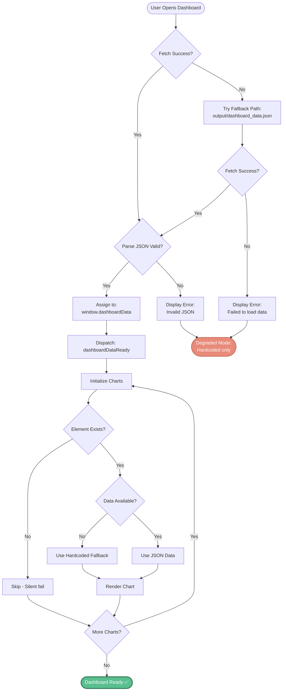

### 6.4 Arquitectura de Componentes (por Tab)

> *Fuente: `MERMAID_DIAGRAMS.md` — Diagrama 7 (extracto)*

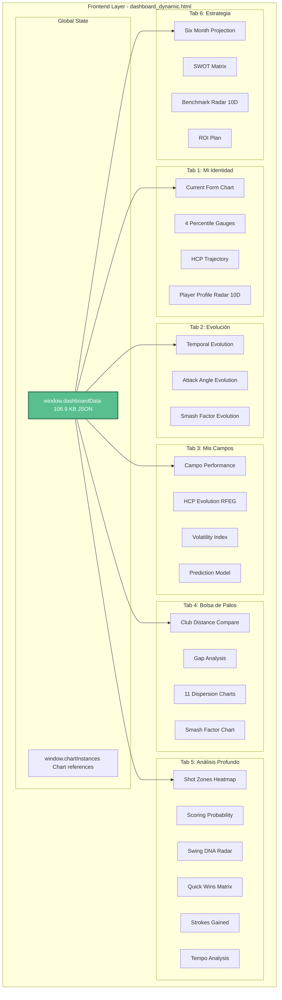

### 6.5 Cobertura de Charts

> *Fuente: `MERMAID_DIAGRAMS.md` — Diagrama 9*

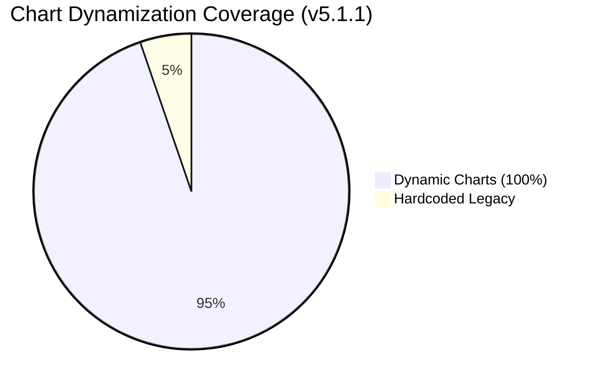

---

## 7. Deployment

> *Fuente: `MERMAID_DIAGRAMS.md` — Diagrama 10*

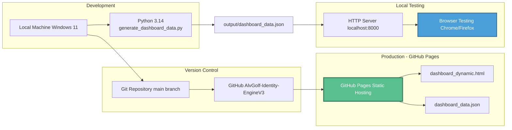

---

## 8. Performance y Costos

### 8.1 Overview General

> *Fuente: `performance-metrics.md`*

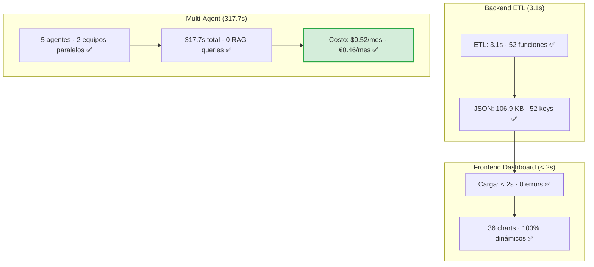

### 8.2 Costos y Evolución del Rendimiento

> *Fuente: `ARCHITECTURE_DIAGRAMS.md` — Diagrama 6*

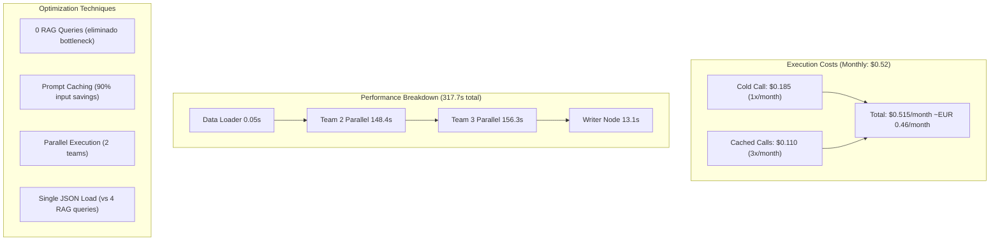

---

## 9. Timeline del Proyecto

### 9.1 Fase 1: Backend ETL (Sprints 1–8)

> *Fuente: `sprint-timeline.md`*

```mermaid
gantt
    title AlvGolf - Fase 1: Backend ETL
    dateFormat YYYY-MM-DD

    section Backend ETL
    Sprint 1-2: Base + Validation        :done, s1, 2026-02-01, 2026-02-03
    Sprint 3: Important Functions (4)    :done, s3, 2026-02-03, 1d
    Sprint 4: Testing Suite              :done, s4, 2026-02-03, 1d
    Sprint 5: Visual Improvements (4)    :done, s5, 2026-02-03, 1d
    Sprint 6: Trend Improvements (4)     :done, s6, 2026-02-03, 1d
    Sprint 7: Finalization               :done, s7, 2026-02-03, 1d

    section Frontend Integration
    Sprint 8: 12 Visualizations          :done, s8, 2026-02-03, 2026-02-04

    section Fixes + Docs
    Post-Integration Bug Fixes           :done, bugs, 2026-02-04, 1d
    Initial Docs + Diagrams              :done, docs, 2026-02-06, 1d
```

### 9.2 Fase 2: Dashboard 100% Dinámico (Sprints 9–13)

> *Fuente: `sprint-timeline.md`*

```mermaid
gantt
    title AlvGolf - Fase 2: 36 Charts Dinámicos
    dateFormat YYYY-MM-DD

    section Sprint 9 (8 funcs)
    current_form, percentile_gauges      :done, s91, 2026-02-07, 1d
    hcp_trajectory, smash_factor         :done, s92, 2026-02-08, 1d

    section Sprint 10-12 (22 funcs)
    Sprint 10: campo, hcp, volatility    :done, s10, 2026-02-08, 1d
    Sprint 11: heatmap, swingDNA, SG     :done, s11, 2026-02-08, 1d
    Sprint 12: SWOT, ROI, projection     :done, s12, 2026-02-09, 1d

    section Sprint 13 Frontend
    Sprint 13A: 14 charts + bugs         :done, s13a, 2026-02-08, 2h
    Sprint 13B: 11 charts protected      :done, s13b, 2026-02-08, 2h
    Sprint 13C: 8 functions verified     :done, s13c, 2026-02-08, 2h
    v5.0.0 PRODUCTION                    :milestone, prod5, 2026-02-09, 0d
```

### 9.3 Fase 3: Mejoras + Multi-Agent System

> *Fuente: `sprint-timeline.md`*

```mermaid
gantt
    title AlvGolf - Fase 3: Features + Multi-Agent
    dateFormat YYYY-MM-DD

    section Sprint 14-15
    Sprint 14: Radar 10D + data fix      :done, s14, 2026-02-12, 1d
    Sprint 15: Heatmap + Mobile iOS      :done, s15, 2026-02-13, 1d
    v5.1.1 PRODUCTION                    :milestone, prod511, 2026-02-13, 0d

    section Multi-Agent System
    TIER 1: FastAPI + RAG + Pinecone     :done, tier1, 2026-02-15, 1d
    v3.0.0: 5 agentes producción         :done, v30, 2026-02-16, 1d
    v3.0.1: UXWriter dashboard           :done, v301, 2026-02-16, 1d
    Docs + HTML fix + Auditoría          :done, final, 2026-02-17, 2026-02-20
    v3.0.1 STABLE                        :milestone, prod301, 2026-02-20, 0d
```

---

## 10. Troubleshooting y Acceso

### 10.1 Diagnóstico CORS (error más común)

> *Fuente: `cors-troubleshooting-flow.md`*

```mermaid
flowchart TD
    START[Usuario quiere ver el dashboard]
    START --> OPEN{¿Cómo abriste<br/>dashboard_dynamic.html?}

    OPEN -->|Doble clic en el archivo| FILE[Protocolo: file:///]
    OPEN -->|python -m http.server 8000| HTTP[Protocolo: http://localhost:8000]

    FILE --> FETCH_ATTEMPT[JavaScript intenta fetch JSON]
    FETCH_ATTEMPT --> CORS_BLOCK[Navegador bloquea fetch]
    CORS_BLOCK --> ERROR_MSG["Error: Failed to fetch<br/>dashboard_data.json<br/>CORS policy blocked"]
    ERROR_MSG --> DASHBOARD_BROKEN["Dashboard roto:<br/>Gráficos vacíos · No hay datos"]
    DASHBOARD_BROKEN --> SOLUTION[SOLUCIÓN]

    SOLUTION --> TERMINAL[Abrir terminal/CMD]
    TERMINAL --> CD["cd C:\Users\alvar\Documents\AlvGolf"]
    CD --> SERVER_CMD["python -m http.server 8000"]
    SERVER_CMD --> HTTP

    HTTP --> FETCH_OK[Fetch permitido]
    FETCH_OK --> JSON_LOAD[JSON carga correctamente]
    JSON_LOAD --> SUCCESS["DASHBOARD FUNCIONAL"]

    style FILE fill:#f8d7da,stroke:#dc3545,stroke-width:3px
    style CORS_BLOCK fill:#f8d7da,stroke:#dc3545,stroke-width:3px
    style DASHBOARD_BROKEN fill:#f8d7da,stroke:#dc3545,stroke-width:3px
    style HTTP fill:#d4edda,stroke:#28a745,stroke-width:3px
    style SUCCESS fill:#d4edda,stroke:#28a745,stroke-width:3px
    style SOLUTION fill:#fff3cd,stroke:#ffc107,stroke-width:3px
```

### 10.2 Árbol de Decisión de Acceso

> *Fuente: `decision-tree-access.md`*

```mermaid
flowchart TD
    START[Necesitas acceder al dashboard]
    START --> Q1{¿Desde dónde?}

    Q1 -->|Solo desde mi PC| LOCAL[Acceso Local]
    Q1 -->|Desde cualquier dispositivo| REMOTE[Acceso Remoto]

    LOCAL --> METHOD_HTTP["✅ RECOMENDADO: Servidor HTTP Local<br/>python -m http.server 8000<br/>→ http://localhost:8000"]

    REMOTE --> Q4{¿Qué tipo?}
    Q4 -->|Privado - Solo yo| GITHUB_PRIVATE["GitHub Pages + Repo Privado<br/>$4/mes GitHub Pro"]
    Q4 -->|Público - Compartir| GITHUB_PUBLIC["GitHub Pages + Repo Público<br/>Gratis (datos públicos)"]
    Q4 -->|Con login| AUTH_FULL["Backend FastAPI + DB<br/>40-60h desarrollo · $15-30/mes"]

    style METHOD_HTTP fill:#d4edda,stroke:#28a745,stroke-width:3px
    style GITHUB_PRIVATE fill:#d4edda,stroke:#28a745,stroke-width:2px
    style AUTH_FULL fill:#f8d7da,stroke:#dc3545,stroke-width:2px
```

---

## Referencia de Archivos

| Archivo fuente | Diagramas en este doc | Sección |
|---------------|----------------------|---------|
| `ARCHITECTURE_DIAGRAMS.md` | Diag 1, 2, 3, 4, 6, 7 | §1, §2.1, §3.1, §3.2, §4, §8.2 |
| `MERMAID_DIAGRAMS.md` | Diag 3, 4, 7, 9, 10, 13 | §6.1–6.5, §7 |
| `agentic-system-architecture.md` | Flowchart principal | §1 (incluido) |
| `data-flow-simplified.md` | Flujo ETL, IA, workflow diario | §5.1–5.3 |
| `performance-metrics.md` | Overview, costos, evolución | §8.1 |
| `sprint-timeline.md` | 3 Gantt charts | §9.1–9.3 |
| `cors-troubleshooting-flow.md` | Diagnóstico CORS | §10.1 |
| `decision-tree-access.md` | Árbol de acceso | §10.2 |

---

*Generado por Claude Sonnet 4.6 · AlvGolf Multi-Agent System v3.0.1 · 2026-02-20*
