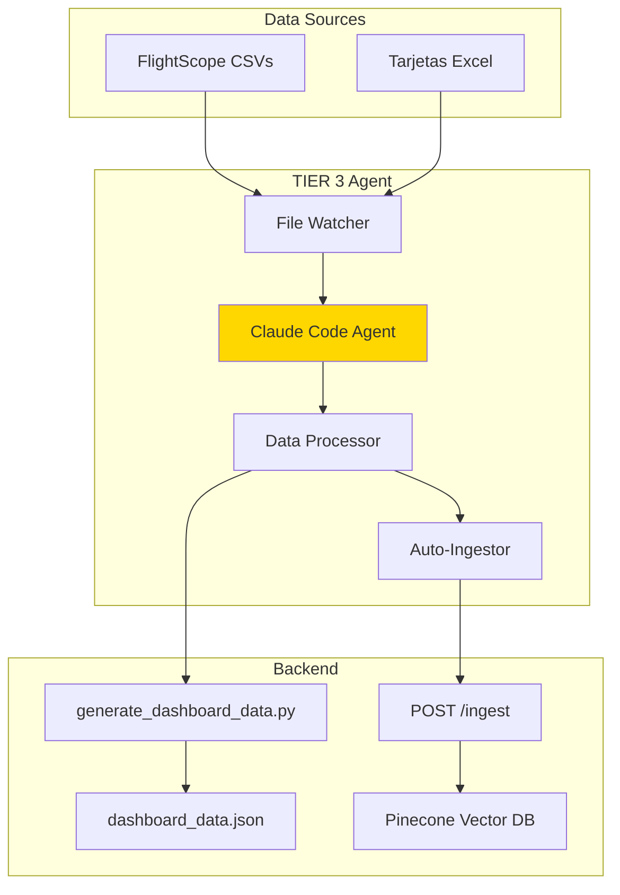

# TIER 3 - Plan de Implementación (Opcional)

**Status:** Propuesta - Pendiente Decisión
**Tiempo estimado:** 3-4 horas
**Complejidad:** Alta
**ROI:** Alto (automatización completa)

---

## 🎯 Objetivo TIER 3

**"Claude Code Terminal Agent" - Dashboard Auto-Actualizable**

Crear un agente autónomo que:
1. **Monitorea** nueva data (FlightScope CSVs, Excel tarjetas)
2. **Procesa** automáticamente cuando detecta cambios
3. **Actualiza** dashboard_data.json
4. **Re-ingesta** a Pinecone
5. **Notifica** usuario de updates

**Resultado:** Dashboard siempre actualizado sin intervención manual

---

## 🏗️ Arquitectura TIER 3



---

## 📊 Comparativa TIER 2 vs TIER 3

| Aspecto | TIER 2 (Actual) | TIER 3 (Propuesto) |
|---------|-----------------|---------------------|
| **Data Updates** | Manual | Automático |
| **Trigger** | Usuario ejecuta script | File watcher |
| **Processing** | Manual Python run | Agent autónomo |
| **Ingestion** | Manual POST /ingest | Auto-ingestion |
| **User Action** | Regenerar análisis | Solo visualizar |
| **Maintenance** | Alta | Baja |
| **Complexity** | Media | Alta |

---

## 🔧 Componentes a Implementar

### 1. File Watcher (watchdog)
```python
# Monitorea data/raw/ por cambios
import watchdog

class DataWatcher:
    def on_modified(self, event):
        if event.src_path.endswith(('.csv', '.xlsx')):
            trigger_claude_code_agent()
```

### 2. Claude Code Terminal Agent
```python
# Agente autónomo con Claude Code
from anthropic import Anthropic

class AutoUpdateAgent:
    def analyze_new_data(self):
        # Claude Code analiza qué cambió
        pass

    def update_pipeline(self):
        # Ejecuta generate_dashboard_data.py
        # POST a /ingest
        pass
```

### 3. Notification System
```python
# Notifica usuario de updates
def notify_update(changes):
    print(f"✅ Dashboard actualizado: {changes}")
    # Opcional: Email, Slack, etc.
```

---

## 📅 Cronograma Estimado (3-4 horas)

### Fase 1: File Watcher (1h)
- [ ] Instalar watchdog
- [ ] Configurar monitoring de data/raw/
- [ ] Test detección de cambios
- [ ] Logging de eventos

### Fase 2: Claude Code Agent (1.5h)
- [ ] Setup Anthropic SDK
- [ ] Implementar agent autónomo
- [ ] Lógica de decisión (qué actualizar)
- [ ] Error handling

### Fase 3: Auto-Processing (1h)
- [ ] Trigger generate_dashboard_data.py
- [ ] Verify JSON output
- [ ] Auto POST /ingest
- [ ] Verify Pinecone update

### Fase 4: Testing + Notification (0.5h)
- [ ] E2E test (drop new CSV → auto-update)
- [ ] Notification system
- [ ] Documentation

---

## 💰 Costos TIER 3

### Desarrollo
- Developer time: 3-4 horas
- Testing: ~$0.20 (API calls)

### Operación Adicional
- Claude Code API: ~$0.05/update
- Frequency: ~2 updates/month
- **Total:** ~$0.10/mes adicional

**Costo total mensual (TIER 2 + TIER 3):** ~$0.85/mes

---

## ✅ Ventajas TIER 3

1. **Automatización Total** - Cero intervención manual
2. **Siempre Actualizado** - Dashboard refleja última data
3. **Error Reduction** - Menos pasos manuales = menos errores
4. **Time Saving** - Usuario solo visualiza, no procesa
5. **Escalable** - Fácil añadir más fuentes

## ⚠️ Desventajas TIER 3

1. **Complejidad** - Más moving parts
2. **Debugging** - Agente autónomo más difícil de debug
3. **Dependencias** - watchdog, más librerías
4. **Overhead** - Process corriendo en background
5. **Costo Incremental** - +$0.10/mes

---

## 🤔 ¿Cuándo Tiene Sentido TIER 3?

### ✅ SÍ implementar si:
- Actualizas data **frecuentemente** (>1x/semana)
- Quieres **eliminar** steps manuales completamente
- Tienes múltiples **fuentes de datos** nuevas
- Valor de **time saved** > costo desarrollo

### ❌ NO implementar si:
- Actualizas data **raramente** (<1x/mes)
- Workflow manual actual es **acceptable**
- Prefieres **control manual** sobre updates
- TIER 2 ya satisface necesidades

---

## 🎯 Alternativa: TIER 2.5 (Híbrido)

**Opción intermedia:** Semi-automático

- Usuario **notifica** manualmente cuando hay nueva data
- Script **automatiza** el resto (process + ingest)
- **Menos complejidad** que TIER 3 completo
- **Más fácil** de mantener

```bash
# Script simple
python scripts/auto_update_dashboard.py

# Ejecuta:
# 1. generate_dashboard_data.py
# 2. POST /ingest automático
# 3. Notification
```

**Tiempo:** 1 hora | **Costo:** $0 adicional

---

## 📊 Matriz de Decisión

| Criterio | TIER 2 | TIER 2.5 | TIER 3 | Peso |
|----------|--------|----------|--------|------|
| **Funcionalidad** | ⭐⭐⭐⭐ | ⭐⭐⭐⭐⭐ | ⭐⭐⭐⭐⭐ | 30% |
| **Simplicidad** | ⭐⭐⭐⭐ | ⭐⭐⭐⭐ | ⭐⭐ | 25% |
| **Costo** | ⭐⭐⭐⭐⭐ | ⭐⭐⭐⭐⭐ | ⭐⭐⭐⭐ | 20% |
| **Mantenimiento** | ⭐⭐⭐ | ⭐⭐⭐⭐ | ⭐⭐⭐ | 15% |
| **Time to Value** | ✅ Listo | 1 hora | 3-4 horas | 10% |
| **SCORE** | 80% | 90% | 75% | |

**Recomendación:** TIER 2.5 (híbrido) ofrece mejor balance

---

## 🚀 Recomendación Final

### Opción 1: **Quedarse en TIER 2** ✅ Recomendado
- Sistema completamente funcional
- Production ready
- Bajo mantenimiento
- Workflow manual acceptable (1x/mes)

### Opción 2: **TIER 2.5 (Híbrido)** ⭐ Mejor ROI
- Script de auto-update simple
- 1 hora de desarrollo
- Elimina 80% de trabajo manual
- Fácil de mantener

### Opción 3: **TIER 3 Completo** 🎯 Máxima Automatización
- Solo si actualizas data >1x/semana
- Justificable para producción a escala
- Requiere inversión de tiempo inicial

---

## 📋 Siguiente Paso

**¿Qué decides?**

1. ✅ **Quedarse en TIER 2** - Mergear, documentar, y usar
2. 🎯 **Implementar TIER 2.5** - Script híbrido (1 hora)
3. 🚀 **Implementar TIER 3** - Automatización completa (3-4 horas)
4. ⏸️ **Pausar y evaluar** - Usar TIER 2 por 1-2 semanas y decidir

---

**Mi recomendación personal:**

Opción 1 (Quedarse en TIER 2) o Opción 2 (TIER 2.5) dependiendo de tu frecuencia de updates.

**¿Cuál prefieres?**

---

**Documentado por:** Claude Sonnet 4.5
**Fecha:** 2026-02-16
**Status:** Propuesta pendiente decisión
